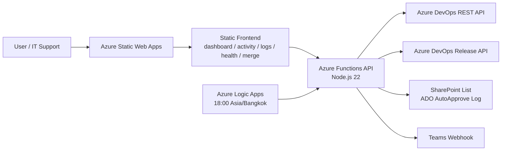

# ADO Auto-Approve

ระบบ Dashboard สำหรับตรวจสอบและอนุมัติ Pull Request บน Azure DevOps โดยออกแบบให้ผู้ใช้งานกลุ่ม `IT Support Approve` สามารถเห็นงาน PR ที่รออนุมัติบน branch `staging` ได้จากหน้าเว็บเดียว พร้อมบันทึกผลการดำเนินการลง SharePoint Log, ตรวจสถานะ Build / Policy, แจ้งเตือน Teams เฉพาะเหตุการณ์สำคัญ, ส่ง Daily Summary รายวัน และมีหน้า Merge Lookup สำหรับช่วยตรวจสอบ CI/CD ของงานประเภท Merge

Production URL:

- Dashboard: https://mango-wave-09cff3700.7.azurestaticapps.net/dashboard.html
- Activity: https://mango-wave-09cff3700.7.azurestaticapps.net/activity.html
- Merge Lookup: https://mango-wave-09cff3700.7.azurestaticapps.net/merge.html
- Audit Logs: https://mango-wave-09cff3700.7.azurestaticapps.net/logs.html
- System Health: https://mango-wave-09cff3700.7.azurestaticapps.net/health.html
- Report (Staging Deployments Summary): https://mango-wave-09cff3700.7.azurestaticapps.net/report.html

## Current Status

สถานะระบบล่าสุด:

- ระบบ deploy บน Azure Static Web Apps
- Azure Functions runtime ใช้ Node.js 22
- Authentication ใช้ Microsoft Entra ID ผ่าน Static Web Apps Auth
- Authorization ของ action สำคัญใช้ role `it_support_approve`
- Dashboard หลักเป็น read/action page สำหรับ Active PR Queue และ Release approval ที่รอ action
- MergeCode / MergeCodeProduction ถูกแยกเป็น manual workflow บน Azure DevOps
- Activity เป็นหน้าดู approval log ล่าสุด 24 ชั่วโมง พร้อม filter และ paging
- Audit Logs อ่านจาก SharePoint และเรียงล่าสุดก่อน
- Daily Summary ส่งผ่าน Azure Logic Apps Consumption เวลา 18:00 Asia/Bangkok
- SharePoint Log Retention รองรับ archive/export ก่อน cleanup โดย default เก็บ 180 วัน
- Branch backup ล่าสุดใช้ `staging` ตัวพิมพ์เล็กเท่านั้น

## วัตถุประสงค์

- ลดเวลาการไล่เปิด Azure DevOps หลายหน้าเพื่อตรวจ PR ที่รออนุมัติ
- รวมรายการ PR ที่เกี่ยวข้องกับ `IT Support Approve` ไว้บน Dashboard เดียว
- แสดงสถานะ Approval, Build, Policy และ Attention ให้เห็นเร็ว
- ทำ Approve / Reject PR ปกติผ่านหน้าเว็บได้อย่างปลอดภัย
- ตรวจ Release approval ที่ผูกกับ build run และกด Approve Release ได้เมื่อ Azure DevOps มี pending approval จริง
- ซ่อน action เมื่อผู้ใช้ไม่มีสิทธิ์หรือ vote ไปแล้ว
- บังคับงาน MergeCode / MergeCodeProduction ให้ทำ manual บน Azure DevOps
- บันทึก audit trail ลง SharePoint Log
- ตรวจสอบ log ย้อนหลังจากหน้า Audit Logs
- แจ้ง Teams เฉพาะเคสที่ควรสนใจ เช่น build/policy exception และ Daily Summary
- ช่วยค้นหา CI/CD ที่ต้องใช้สำหรับ PR ประเภท Merge ผ่านหน้า Merge Lookup

## High-Level Architecture



## Documentation

| Document | Purpose |
|---|---|
| `docs/approve-release-workflow.md` | แผนภาพและ guardrails ของ workflow Approve Release |

## Main Pages

| Page | Path | Purpose |
|---|---|---|
| Login | `/` | Login ผ่าน Microsoft Entra ID |
| Dashboard | `/dashboard.html` | ตรวจ Active PR Queue, Approve/Reject PR, ดู Build/Policy/Release และกด Approve Release เมื่อมี pending approval |
| Activity | `/activity.html` | ดู PR ที่ user approve หรือระบบ detect external approval ใน 24 ชั่วโมงล่าสุด พร้อม filter Build Failed / Policy Pending / source และ paging |
| Merge Lookup | `/merge.html` | กรอก PR ID เพื่อหา CI/CD ของงาน Merge |
| Deploy History | `/deploy-history.html` | ค้นหา คัดกรอง และดูประวัติการรัน Build & Deploy ย้อนหลังบนระบบ Staging |
| Build Diagnostics | `/build-diagnostics.html` | หน้าวิเคราะห์และแปลความหมายข้อผิดพลาดของ Build Log พร้อมเสนอแนวทางแก้ไขภาษาไทย |
| Audit Logs | `/logs.html` | ค้นหา SharePoint Log ตาม PR, action, source, keyword |
| System Health | `/health.html` | ตรวจ Backend, ADO, SharePoint, Teams, Daily Summary, Last Sync/Notification |
| Forbidden | `/403.html` | แสดงเมื่อผู้ใช้ไม่มีสิทธิ์ |
| Report | `/report.html` | ดูรายงานสรุปสถิติผลการดำเนินงานและสถิติ (รายวัน/รายเดือน) พร้อมตัวกรอง All/My actions, scope ของ Staging builds, รายการ failed build ล่าสุด และระบบซิงก์ข้อมูลบิลด์อัตโนมัติเบื้องหลัง |

## Dashboard Behavior

หน้า Dashboard แสดงเฉพาะ PR ที่เกี่ยวข้องกับ:

- target branch เริ่มจาก `refs/heads/staging` หรือเป็น MergeCode target branch ที่ระบบรองรับ
- reviewer group มี `IT Support Approve`
- สถานะ active สำหรับ Active PR Queue
- ซ่อน PR ที่ approval complete + policy/build ไม่มีปัญหา + ไม่มี release approval pending เพื่อไม่ให้ค้างใน Active Queue โดยไม่จำเป็น

ข้อมูลที่แสดง:

- Pull Request: PR ID, title, repository, author, created time
- Branch: From / Into
- Approvals: จำนวนที่ approve เทียบ required approval
- Build / Policy: Build Success, Build Failed, Policy Pending, Policy Approved ฯลฯ
- Release: Release expected, Release approval pending, Release approved, Deploying, Deploy succeeded, Deploy failed, No release yet
- Attention: New, Waiting, Warning, Critical, Stale, Manual
- My Approval: สถานะ vote ของผู้ใช้ปัจจุบัน
- Actions: Approve, Reject, Approve Release, History, Open ADO / Open Release ตามสิทธิ์และสถานะ

### Active PR Queue

ใช้สำหรับงานที่ยังรอ approval อยู่ ผู้ใช้ที่มี role `it_support_approve` จะเห็นปุ่ม action เฉพาะเมื่อยัง vote ได้

เงื่อนไข action:

- ถ้าผู้ใช้ไม่มี role `it_support_approve` จะไม่แสดง Approve / Reject
- ถ้าผู้ใช้ approve/reject ไปแล้ว จะแสดง `Vote submitted`
- ถ้าเป็น MergeCode / MergeCodeProduction จะแสดง `Manual in Azure DevOps`
- ถ้างานไม่ใช่ reviewer ของผู้ใช้ จะแสดงสถานะที่เหมาะสมและไม่เปิด action ที่ไม่ควรทำ
- ถ้า PR approval complete แล้ว แต่มี `Release approval pending` จะยังอยู่ใน Active Queue เพื่อให้กด `Approve Release`
- ถ้า PR approval/policy ครบแล้วและไม่มี release approval pending ระบบจะซ่อนออกจาก Active Queue

### Guarded Auto Approve Mode

แผงควบคุมโหมดการทำงานสำหรับกลุ่ม `IT Support Approve` บนหน้า Dashboard ซึ่งรองรับการตั้งค่า 3 โหมดหลัก:
- `OFF` (Normal): ดำเนินการอนุมัติแบบ Manual ทีละรายการผ่านหน้าเว็บ
- `ACTIVE (Manual)` (Dry-run): บอทช่วยจำลองการตรวจ PR คิว แต่จะไม่ส่งคำสั่ง Approve ไปยัง Azure DevOps จริง (มีไว้สำหรับทดสอบ)
- `ACTIVE (Auto-Approve)` (Active): บอทตรวจคิว PR และ Release อัตโนมัติ หากผ่าน Guardrail และเงื่อนไขระบบ จะอนุมัติ (Approve) ให้อัตโนมัติทันที
- การเปิดใช้งานโหมด Active จะมีระยะเวลาหมดอายุ (Expiry Countdown) ตามที่ผู้ใช้กำหนด (เช่น 30 นาที, 1 ชั่วโมง หรือสิ้นสุดวันทำงาน) เมื่อครบกำหนดระบบจะ Reset กลับเป็นโหมด Normal/OFF อัตโนมัติเพื่อความปลอดภัย

### Approval Hold

ระบบรองรับการระงับการทำงานอนุมัติชั่วคราว (Hold) สำหรับ PR บางรายการ เพื่อป้องกันการอนุมัติโดยไม่ตั้งใจ:
- ผู้ใช้ที่มีสิทธิ์สามารถกดปุ่ม **Hold** และระบุเหตุผล (จำเป็น) ได้จากหน้า Dashboard
- ข้อมูลการ Hold จะบันทึกลง SharePoint Log
- ตราบใดที่ PR ยังอยู่ในสถานะ **Hold** ปุ่ม Action ทั้งหมดบนหน้า Dashboard สำหรับ PR นั้น (Approve, Reject, Approve Release) จะถูกปิดใช้งานชั่วคราว
- เมื่อต้องการให้ดำเนินการต่อได้ ให้กดปุ่ม **Unlock** เพื่อปลดล็อกสถานะ Hold

### Release Approval

ระบบตรวจ Classic Release ที่เกี่ยวข้องกับ Build ID ของ PR และแสดงสถานะในคอลัมน์ Release

สถานะ Release ที่รองรับ:

- `Release approval pending`: พบ pending approval จริงใน Azure DevOps และแสดงปุ่ม `Approve Release`
- `Release expected`: คาดว่ามี CD จาก CI/CD mapping แต่ยังไม่พบ pending approval จริง จึงไม่เปิดปุ่ม approve
- `Release approved`: release approval ถูก approve แล้ว
- `Deploying`: release environment กำลัง run / queued / scheduled
- `Deploy succeeded`: release environment deploy สำเร็จ
- `Deploy failed`: release environment failed / canceled / rejected
- `Waiting release`: release พบแล้วแต่ environment ยังไม่เริ่ม
- `No release yet`: ยังไม่พบ release ที่ผูกกับ build
- `Release lookup failed`: ระบบเช็ค release ไม่สำเร็จ

Guardrail:

- ปุ่ม `Approve Release` จะแสดงเฉพาะเมื่อ Azure DevOps แจ้งว่า release approval ยังเป็น `pending`
- ก่อน approve ระบบ re-check release approval ล่าสุดอีกครั้ง
- ระบบไม่ approve จาก mapping อย่างเดียว
- เมื่อ approve สำเร็จ ระบบบันทึก SharePoint Log เป็น action `Release Approved`
- เอกสาร workflow อยู่ที่ `docs/approve-release-workflow.md`

### Activity

หน้า `/activity.html` แสดง PR ที่ผู้ใช้ approve หรือระบบ detect external approval ในช่วงล่าสุด โดย default:

- Lookback: 24 hours
- Page size: 10 items
- มี Previous / Next เพื่อดูรายการทั้งหมดในช่วง lookback

ข้อมูลใน Activity:

- Latest Status: Completed, Build Failed, Policy Pending, Active / Pending
- Approval Source: Dashboard approved หรือ External approved
- Actions: History และ Open ADO

Activity ใช้ SharePoint approval log เป็นจุดตั้งต้น แล้ว enrich สถานะล่าสุดจาก Azure DevOps เพื่อให้เห็นผลจริงหลัง approve เช่น build fail, policy pending หรือ completed

## MergeCode / MergeCodeProduction Workflow

ระบบไม่ approve งาน MergeCode ผ่าน Dashboard เพราะ risk สูงและต้องเลือกขั้นตอนบน Azure DevOps อย่างระมัดระวัง

งานกลุ่มนี้จะถูก highlight และแสดงเป็น manual:

- ไม่มีปุ่ม Approve / Reject ผ่านเว็บ
- มีปุ่ม Open ADO
- แสดงสถานะ Build / Policy และ Attention
- สามารถดู history ได้

แนวทาง manual บน Azure DevOps:

1. เปิด PR จากปุ่ม Open ADO
2. ตรวจ source/target branch
3. ตั้ง Auto-complete ตาม process ของทีม
4. ใช้ merge strategy ที่ถูกต้อง เช่น Merge no fast-forward เมื่อ process กำหนด
5. ตรวจ optional checks ที่เกี่ยวข้อง
6. Approve หรือจัดการต่อบน Azure DevOps โดยตรง

## Merge Lookup

หน้า `/merge.html` ใช้สำหรับค้นหา CI/CD ของ PR ประเภท Merge โดยกรอก PR ID

Logic เป็นแบบ Hybrid:

1. ดึง PR จริงจาก Azure DevOps
2. อ่าน repository, source branch, target branch
3. ตรวจ build run ของ target branch
4. ถ้า match branch rule เฉพาะ ให้ใช้ rule นั้น
5. ถ้าไม่ match hardcoded rule แต่พบ CI run ให้ lookup จาก Staging CI/CD mapping
6. แสดง Recommended CI/CD และ Detected Build

ข้อมูลที่แสดง:

- PR ID, title, repo, author, status, created time
- Source branch / target branch
- Recommended CI name
- Recommended CD name
- CI ID / CI folder
- CD ID / CD path
- Mapping source เช่น `branch-rule` หรือ `staging-csv`
- Detected build run, status, result, branch, build link

### Staging CI/CD Mapping

ไฟล์ mapping ที่ระบบใช้งานจริง:

```text
api/shared/stg-ci-cd-map.json
```

ไฟล์นี้ generate จาก CSV ต้นทาง:

| CSV | ความหมาย |
|---|---|
| `pipelines.csv` | รายชื่อ CI |
| `release-pipelines.csv` | รายชื่อ CD |
| `ci_cd_mapping.csv` | Mapping CI -> CD |

ปัจจุบัน import เฉพาะ Staging (`stg`) เข้า repo จำนวนประมาณ 2,891 mappings

เมื่อมี CI/CD ใหม่:

1. อัปเดต CSV ต้นทางก่อน
2. regenerate `api/shared/stg-ci-cd-map.json`
3. ทดสอบด้วย PR ตัวอย่าง
4. commit / push / deploy

ไม่ควรแก้ `stg-ci-cd-map.json` ด้วยมือถ้าไม่จำเป็น เพราะเสี่ยงข้อมูลไม่ตรง CSV ต้นทาง

## Audit Logs

หน้า `/logs.html` ใช้ตรวจสอบ SharePoint Log

Filter ที่รองรับ:

- PR ID เช่น `342997` หรือ `#342997`
- Action เช่น Approved, Dashboard approved, External approved, Rejected, Notification, Build Failed, Policy Pending, Failed / Error
- Source เช่น Dashboard, Azure DevOps Sync, Teams
- Keyword เช่น user, repo, title, result, reason
- Limit: 50 หรือ 100

ลำดับการแสดง:

- API ดึง log จาก SharePoint ด้วย `lastModifiedDateTime desc`
- Backend sort ซ้ำด้วย `createdAt desc`
- ถ้าเวลาซ้ำ ใช้ `lastModifiedAt` และ `id` เป็น tie-breaker
- ผลลัพธ์บนหน้าเว็บจึงแสดงล่าสุดก่อน

Log source สำคัญ:

- `Dashboard`: action ที่เกิดจากเว็บหรือ sync จาก Azure DevOps
- `Azure DevOps Sync`: external vote ที่ตรวจพบจาก dashboard refresh
- `Teams`: notification หรือ summary
- `Dashboard Test Daily Summary`: การทดสอบ Daily Summary จากหน้า Health

## SharePoint Log

ระบบเขียน log ลง SharePoint List ผ่าน Microsoft Graph

Column สำคัญที่ใช้:

| Column | Purpose |
|---|---|
| `Title` | ชื่อ log item |
| `PR_ID` | PR number |
| `Action` | Approved, Rejected, External Approved, Notification Sent ฯลฯ |
| `User` | ผู้ดำเนินการ |
| `Repository` | repo |
| `PR_Title` | title ของ PR |
| `Target_Branch` | target branch |
| `Result` | ผลลัพธ์ |
| `Reason` | เหตุผลหรือรายละเอียด |
| `Source` | Dashboard, Teams, Azure DevOps Sync |
| `Event_Key` | key กัน duplicate |
| `Build_Status` | build status |
| `Build_Result` | build result |
| `Policy_Status` | policy status |
| `Merge_Status` | merge status |
| `AutoComplete_Status` | auto-complete status |
| `Last_Checked_At` | เวลาตรวจล่าสุด |
| `ADO_Build_URL` | link build |
| `ADO_PR_URL` | link PR |

หมายเหตุ:

- `SHAREPOINT_AUTO_CREATE_LOG_COLUMNS=false` จะปิด auto-create optional columns
- หาก Azure DevOps action สำเร็จแต่ SharePoint log ล้มเหลว ระบบจะแจ้ง error เพื่อให้ตรวจย้อนหลังได้

### SharePoint Log Retention / Cleanup

ระบบรองรับ retention policy สำหรับ SharePoint Log โดยแนวทางหลักคือเก็บข้อมูลใน List 180 วัน และ archive เป็น CSV ก่อน delete

Endpoint:

```text
POST /api/log-retention-cleanup
```

Header:

```text
x-log-retention-token: <LOG_RETENTION_TOKEN หรือ DAILY_SUMMARY_TOKEN>
```

Body สำหรับ dry run:

```json
{
  "dryRun": true,
  "retentionDays": 180,
  "maxItems": 500
}
```

Body สำหรับ cleanup จริง:

```json
{
  "dryRun": false,
  "retentionDays": 180,
  "maxItems": 500,
  "deleteAfterArchive": true
}
```

หลักการทำงาน:

- Query SharePoint List เฉพาะ items ที่ `createdDateTime` เก่ากว่า cutoff
- Export เป็น CSV พร้อม UTF-8 BOM เพื่อเปิดใน Excel ได้ง่าย
- Upload เข้า SharePoint Document Library path ตามรูปแบบ `ADO AutoApprove Archive/YYYY/MM/...csv`
- Delete list items เฉพาะเมื่อ upload archive สำเร็จ
- บันทึก summary log กลับเข้า SharePoint ด้วย action `Log Retention Cleanup`
- Default ของ endpoint คือ `dryRun=true` เพื่อป้องกันการลบโดยไม่ตั้งใจ

แนะนำให้ Azure Logic Apps Consumption เรียก endpoint นี้เดือนละครั้ง เช่น วันที่ 1 เวลา 01:00 Asia/Bangkok

## System Health

หน้า `/health.html` แสดงรายละเอียดสถานะระบบ

Checks หลัก:

- Auth: ผู้ใช้ login ได้
- Backend: API runtime, uptime, Node version
- Azure DevOps: PAT/config เชื่อมต่อได้
- SharePoint Log: site/list/read recent logs ได้
- Teams Webhook: webhook URL ถูก config
- Daily Summary: token และ scheduler พร้อม
- Last Sync: เวลา refresh PR ล่าสุดจาก dashboard
- Last Notification: notification ล่าสุดจาก SharePoint log
- Last Exception Scan: exception scan ล่าสุดจาก SharePoint log
- Last Retention Cleanup: retention cleanup ล่าสุดจาก SharePoint log
- Next Summary: รอบส่งสรุปรายวันถัดไป

Diagnostic Tools:

- Test Teams Notification
- Test Daily Summary
- Scan Build/Policy Alerts
- Test Backend Health

## Teams Notification

ระบบมี notification 2 กลุ่มหลัก:

### Build / Policy Exception Notification

ใช้แจ้งเฉพาะเหตุการณ์ที่ควรสนใจ เพื่อลด noise เช่น:

- build failed
- policy failed
- rejected active PR
- stale/critical attention ตาม logic ที่ระบบกำหนด

ระบบมี endpoint แยกสำหรับ scan exception จาก SharePoint approval log โดยไม่ต้องพึ่งการโหลดหน้า Dashboard:

```text
POST /api/exception-scan
```

Header:

```text
x-exception-scan-token: <EXCEPTION_SCAN_TOKEN หรือ DAILY_SUMMARY_TOKEN>
```

หลักการทำงาน:

- อ่าน approval logs ล่าสุดตามช่วงเวลาที่กำหนด
- ดึง PR / Build / Policy ล่าสุดจาก Azure DevOps
- ส่ง Teams เฉพาะ Build Failed หรือ Policy Failed
- กันส่งซ้ำด้วย `Event_Key` ที่รวม PR, issue type และ build run id เมื่อมีข้อมูล

สามารถปิดด้วย:

```text
TEAMS_EXCEPTION_NOTIFICATIONS=false
```

### Build Failure REST Polling

ถ้า Azure DevOps Service Hook ใช้งานไม่เสถียร ให้ใช้ Azure Logic Apps Consumption เรียก endpoint นี้แทน:

```text
POST /api/build-failure-scan
```

Header:

```text
x-build-failure-scan-token: <BUILD_FAILURE_SCAN_TOKEN หรือ DAILY_SUMMARY_TOKEN>
```

Body ตัวอย่าง:

```json
{
  "lookbackMinutes": 30,
  "maxBuilds": 100
}
```

หลักการทำงาน:

- Query Azure DevOps REST API หา build ที่ `completed` และ `failed` ในช่วงเวลาล่าสุด
- Default lookback คือ 30 นาที และดึงสูงสุด 100 builds
- กรองเฉพาะ pipeline ที่มีคำว่า `stg` และ branch ที่ขึ้นต้นด้วย `refs/heads/staging`
- ส่ง Teams หนึ่งครั้งต่อ build ด้วย `Event_Key` รูปแบบ `teams:build-failed:<buildId>`
- บันทึก SharePoint Log ด้วย source `ADO REST Build Failure Scan`

แนะนำให้ตั้ง Logic Apps เรียกทุก 5-10 นาที โดยให้ `lookbackMinutes` มากกว่ารอบ schedule เล็กน้อย เช่น schedule ทุก 10 นาที ใช้ lookback 30 นาที เพื่อกันช่วงที่ scheduler delay และให้ duplicate guard กันการส่งซ้ำ

สำหรับทดสอบโดยไม่ส่ง Teams ให้ใส่:

```json
{
  "dryRun": true,
  "lookbackMinutes": 30
}
```

### Daily PR Summary

ระบบรองรับการส่งสรุปภาพรวมรายวัน (Daily Summary) ไปยัง 2 ช่องทางหลักตามรอบเวลาที่กำหนด:

1. **MS Teams Daily Summary (รอบ 18:00 น. Asia/Bangkok):**
   * ส่งแจ้งเตือนสรุปรายวันเข้ากลุ่ม MS Teams ผ่าน endpoint:
     ```text
     POST /api/daily-summary
     ```
   * ข้อมูลเป็นสถานะสด ณ เวลา 18:00 น.
   * ใช้ Header: `x-daily-summary-token: <DAILY_SUMMARY_TOKEN>`
2. **LINE OA Daily Summary (รอบ 23:59 น. Asia/Bangkok):**
   * ส่งแจ้งเตือนสรุปรายวันเข้าแชท/กลุ่ม LINE OA ผ่าน endpoint:
     ```text
     POST /api/line-daily-summary
     ```
   * **การคำนวณข้อมูล:** ดึงและรวบรวมข้อมูลสดแบบเรียลไทม์ครบถ้วนตลอดทั้งวัน (00:00 - 23:59 น.) ซึ่งทำให้รายงานของ LINE จะครอบคลุมกิจกรรมทั้งหมด รวมถึง PR ที่มีการอนุมัติหรือสร้างใหม่ในช่วงเวลาหลังรอบส่งของ Teams (18:00 - 23:59 น.) และจะสแกนสถานะคิวรออนุมัติล่าสุด (Active now) ณ เวลาเที่ยงคืนก่อนเริ่มวันถัดไป
   * ใช้ Header: `x-line-daily-summary-token: <LINE_DAILY_SUMMARY_TOKEN>`

ระบบมี duplicate guard ด้วย `Event_Key` ใน SharePoint (`teams:daily-summary:<dateKey>` และ `line:daily-summary:<dateKey>`) เพื่อไม่ให้ส่งซ้ำในวันเดียวกันในแต่ละช่องทางโดยเฉพาะ *(หมายเหตุ: ระบบ Duplicate Guard จะทำการกรองและมองข้าม Log ที่เกิดจากคำสั่งทดสอบ (Test Mode) เสมอ เพื่อไม่ให้ประวัติการกดทดสอบไปขัดขวางการส่งสรุปจริงตอนสิ้นวัน)*

## Authentication และ Authorization

ระบบใช้ Azure Static Web Apps Auth + Microsoft Entra ID

Routes สำคัญ:

| Route | Allowed roles |
|---|---|
| `/dashboard.html` | `authenticated` |
| `/merge.html` | `authenticated` |
| `/logs.html` | `authenticated` |
| `/health.html` | `authenticated` |
| `/report.html` | `authenticated` |
| `/api/list-prs` | `authenticated` |
| `/api/merge-lookup` | `authenticated` |
| `/api/logs` | `authenticated` |
| `/api/report-summary` | `authenticated` |
| `/api/pr-history/*` | `authenticated` |
| `/api/health` | `authenticated` |
| `/api/approve-pr` | `it_support_approve` |
| `/api/reject-pr` | `it_support_approve` |
| `/api/approve-release` | `it_support_approve` |
| `/api/daily-summary` | `anonymous` + header token |
| `/api/line-daily-summary` | `anonymous` + header token |
| `/api/sync-deployments` | `anonymous` + header/query token |
| `/api/exception-scan` | `anonymous` + header token |
| `/api/build-failure-scan` | `anonymous` + header token |
| `/api/log-retention-cleanup` | `anonymous` + header token |
| `/api/webhook` | `anonymous` + basic auth |

Role display:

- System roles เช่น `anonymous`, `authenticated` ถูกซ่อนจาก UI
- `it_support_approve` แสดงเป็น `IT Support Approve`
- ถ้าไม่มี approval role จะแสดงเป็น authenticated user แต่ไม่เปิดปุ่ม action

## User Profile / Display Name

ค่า user เริ่มต้นมาจาก Static Web Apps client principal ซึ่งมักเป็น email

มี optional Graph lookup:

```text
GRAPH_USER_PROFILE_LOOKUP=true
```

เมื่อตั้งค่านี้ ระบบจะพยายามดึง display name จาก Microsoft Graph ผ่าน app credential

ต้องมี Graph application permission ที่เหมาะสม เช่น `User.Read.All` พร้อม admin consent

ถ้าไม่ได้เปิด feature นี้ ระบบ fallback เป็น email ตามเดิม

## Backend API

| API | Method | Purpose |
|---|---|---|
| `/api/userinfo` | GET | คืน user, roles, permissions |
| `/api/list-prs` | GET | ดึง Active PR Queue และ Activity lookup เมื่อส่ง `includeActivity=true` |
| `/api/approve-pr` | POST | Approve PR ปกติ, set auto-complete, log SharePoint |
| `/api/reject-pr` | POST | Reject PR ปกติ, log SharePoint |
| `/api/approve-release` | POST | Approve Azure DevOps Classic Release pre-deploy approval ที่ยัง pending และ log SharePoint |
| `/api/approval-hold` | POST | ตั้งค่า Hold หรือ Release สถานะระงับการอนุมัติของ PR บน Dashboard |
| `/api/auto-approve-settings` | GET/POST | ดึงหรืออัปเดตการตั้งค่าโหมด Guarded Auto Approve |
| `/api/build-diagnostics` | GET/POST | วิเคราะห์ Timeline และเนื้อหา Log ความล้มเหลวของ Build พร้อมบันทึก/ส่งแจ้งเตือน Teams |
| `/api/deploy-history` | GET | ดึงข้อมูลประวัติการ Deploy จากไฟล์ CSV บน SharePoint |
| `/api/sync-deployments` | GET/POST | ดึงและประสานประวัติการรัน Build & Deploy จาก Azure DevOps บันทึกเก็บเป็นไฟล์ CSV ตามปีบน SharePoint (โดยคัดกรองยกเว้นพวก Scheduled/Infrastructure system tasks ที่มีชื่อ Pipeline มีคำว่า `schedule` หรือ `scripts` ออกโดยอัตโนมัติ) |
| `/api/report-summary` | GET | ดึงข้อมูลรายงานสรุปสถิติผลการดำเนินงาน (การอนุมัติ, อัตรา Auto-Approve, อัตราความสำเร็จของบิลด์) |
| `/api/create-tag` | POST | สร้าง Git Tag ใน Azure DevOps ชี้ไปยัง Commit SHA ที่กำหนด |
| `/api/pr-history/{prId}` | GET | อ่าน history ของ PR จาก SharePoint |
| `/api/logs` | GET | อ่าน audit logs จาก SharePoint |
| `/api/health` | GET | ตรวจ authenticated system health หลัง login |
| `/api/merge-lookup` | GET | ค้นหา CI/CD ของ Merge PR |
| `/api/test-notification` | POST | ทดสอบ Teams notification |
| `/api/test-daily-summary` | POST | ทดสอบ Daily Summary |
| `/api/test-exception-scan` | POST | ทดสอบ Build/Policy exception scan จากหน้า Health |
| `/api/daily-summary` | POST | endpoint สำหรับ Logic Apps scheduler |
| `/api/line-daily-summary` | POST | endpoint สำหรับ Logic Apps LINE Daily Summary scheduler (ส่ง 23:59 น.) |
| `/api/exception-scan` | POST | endpoint สำหรับสแกน Build/Policy failed จาก approval logs |
| `/api/build-failure-scan` | POST | endpoint สำหรับ Logic Apps polling หา Build failed จาก Azure DevOps REST API โดยตรง |
| `/api/log-retention-cleanup` | POST | endpoint สำหรับ archive/export/delete SharePoint logs เก่ากว่า retention window |
| `/api/webhook` | POST | legacy/webhook notification endpoint |

## Important Shared Modules

| File | Purpose |
|---|---|
| `api/shared/ado-client.js` | Azure DevOps REST API client |
| `api/shared/sharepoint-client.js` | Microsoft Graph / SharePoint List client |
| `api/shared/auth.js` | role / principal helper |
| `api/shared/attention.js` | PR aging / stuck / attention logic |
| `api/shared/approval-hold.js` | ดึงสถานะและบันทึก Log การระงับการอนุมัติ (Hold State) |
| `api/shared/build-diagnostics-catalog.js` | ฐานข้อมูลรูปแบบ Error และกฎการวิเคราะห์ปัญหาของ Build Log |
| `api/shared/notification-service.js` | exception notification orchestration |
| `api/shared/teams-notifier.js` | Teams webhook client |
| `api/shared/line-notifier.js` | LINE Messaging API client |
| `api/shared/merge-pipeline-map.js` | Merge branch rule + Staging CSV lookup |
| `api/shared/stg-ci-cd-map.json` | generated Staging CI/CD mapping |
| `api/shared/user-profile.js` | optional Graph display name lookup |

## Attention / PR Aging Logic

ระบบแสดง Attention เพื่อช่วยให้เห็น PR ที่ควรรีบตรวจ

ตัวอย่างสถานะ:

| Status | Meaning |
|---|---|
| New | PR ยังใหม่ อยู่ในช่วงเวลาปกติ |
| Waiting | รอ approval เกินช่วงสั้น ๆ |
| Warning | เริ่มรอนาน |
| Critical | รอนานมากหรือมีสัญญาณเสี่ยง |
| Stale | ค้างนานจนควรตรวจ |
| Manual | เป็น MergeCode/MergeCodeProduction ต้องทำใน ADO |
| Ready | approval / policy พร้อมตามเงื่อนไข |

Logic อยู่ใน:

```text
api/shared/attention.js
```

ใช้ร่วมกันใน Dashboard และ Daily Summary เพื่อลดความคลาดเคลื่อน

## Environment Variables

ค่าจริงต้องเก็บใน Azure Static Web Apps Configuration หรือ GitHub Secrets ห้าม commit ลง repo

### Azure DevOps

| Variable | Required | Description |
|---|---:|---|
| `ADO_ORGANIZATION` | Yes | organization จาก `dev.azure.com/<org>` |
| `ADO_PROJECT` | Yes | Azure DevOps project |
| `ADO_PAT` | Yes | PAT สำหรับอ่าน PR, vote, policy, build และ Classic Release approval |
| `ADO_TARGET_BRANCH` | No | default `refs/heads/staging` |
| `ADO_REVIEWER_GROUP` | No | default `IT Support Approve` |
| `ADO_EXTERNAL_LOG_SYNC` | No | set `false` เพื่อปิด external vote sync log |

### Auth / Role

| Variable | Required | Description |
|---|---:|---|
| `AUTH_REQUIRED_ROLE` | No | default `it_support_approve` |
| `GRAPH_USER_PROFILE_LOOKUP` | No | set `true` เพื่อเปิด Graph display name lookup |

### SharePoint / Graph

| Variable | Required | Description |
|---|---:|---|
| `AAD_TENANT_ID` | Yes | Entra tenant id |
| `AAD_CLIENT_ID` | Yes | app registration client id |
| `AAD_CLIENT_SECRET` | Yes | app registration secret |
| `SHAREPOINT_HOSTNAME` | Yes | เช่น `buzzebees.sharepoint.com` |
| `SHAREPOINT_SITE_PATH` | Yes | เช่น `/sites/ADOAuto-Approve` |
| `SHAREPOINT_LIST_NAME` | No | default `ADO Auto-Approve Log` |
| `SHAREPOINT_AUTO_CREATE_LOG_COLUMNS` | No | set `false` เพื่อปิด auto-create optional columns |

### Teams / Notification

| Variable | Required | Description |
|---|---:|---|
| `TEAMS_WEBHOOK_URL` | For notification | Teams webhook endpoint |
| `TEAMS_EXCEPTION_NOTIFICATIONS` | No | set `false` เพื่อปิด exception alerts |
| `DAILY_SUMMARY_TOKEN` | For daily summary | token ที่ Logic Apps ส่งมาใน header |
| `EXCEPTION_SCAN_TOKEN` | No | token สำหรับ `/api/exception-scan`; ถ้าไม่ตั้งจะ fallback ไปใช้ `DAILY_SUMMARY_TOKEN` |
| `BUILD_FAILURE_SCAN_TOKEN` | No | token สำหรับ `/api/build-failure-scan`; ถ้าไม่ตั้งจะ fallback ไปใช้ `DAILY_SUMMARY_TOKEN` |
| `LOG_RETENTION_TOKEN` | No | token สำหรับ `/api/log-retention-cleanup`; ถ้าไม่ตั้งจะ fallback ไปใช้ `DAILY_SUMMARY_TOKEN` |
| `LOG_RETENTION_DAYS` | No | default `180` |
| `LOG_RETENTION_BATCH_LIMIT` | No | default `500`, max `1000` |
| `LOG_ARCHIVE_FOLDER` | No | default `ADO AutoApprove Archive` |

### LINE / Notification

| Variable | Required | Description |
|---|---:|---|
| `LINE_CHANNEL_ACCESS_TOKEN` | For LINE notification | Channel Access Token (Long-lived) ของ LINE OA |
| `LINE_TARGET_ID` | For LINE notification | ID ปลายทางที่ต้องการส่งข้อความ (Group ID `C...` หรือ User ID `U...`) |
| `LINE_DAILY_SUMMARY_TOKEN` | For LINE summary | Token ที่ตั้งไว้เพื่อใช้ตรวจสอบสิทธิ์ใน header สำหรับ `/api/line-daily-summary` |

### Webhook

| Variable | Required | Description |
|---|---:|---|
| `WEBHOOK_USERNAME` | For webhook | basic auth username |
| `WEBHOOK_PASSWORD` | For webhook | basic auth password |
| `STAGING_BRANCH_REF` | No | default `refs/heads/staging` |

### Dashboard Options

| Variable | Required | Description |
|---|---:|---|
| `COMPLETED_PR_LOOKBACK_HOURS` | No | default `24` |
| `COMPLETED_PR_DISPLAY_LIMIT` | No | default `10` |

## Deployment

ระบบ deploy ผ่าน GitHub Actions:

```text
.github/workflows/azure-static-web-apps.yml
```

Workflow deploy เมื่อ push เข้า:

- `main`
- `master` (รองรับไว้ แต่ปัจจุบันใช้ `main`)

Azure Static Web Apps config:

```text
public/staticwebapp.config.json
```

Runtime:

```json
{
  "platform": {
    "apiRuntime": "node:22"
  }
}
```

## Branch Policy / Backup

Branch ที่ใช้ปัจจุบัน:

| Branch | Purpose |
|---|---|
| `main` | production/current stable version |
| `staging` | backup branch ล่าสุด ชี้ commit เดียวกับ `main` |

หมายเหตุ:

- ไม่มี `Staging` ตัวพิมพ์ใหญ่แล้ว
- ไม่มี `backup/pre-node22-20260602` แล้ว
- หากต้อง backup สถานะล่าสุด ให้ push `main` ไป `staging`

ตัวอย่าง:

```powershell
git push origin main:staging
```

## Local Validation

ก่อน push ควรตรวจ:

```powershell
git status --short --branch
node --check public\core.js
node --check public\dashboard.js
node --check public\activity.js
node --check public\logs.js
node --check public\health.js
node --check public\merge.js
node --check public\build-diagnostics.js
node --check public\deploy-history.js
node --check api\userinfo\index.js
node --check api\health\index.js
node --check api\list-prs\index.js
node --check api\approve-pr\index.js
node --check api\reject-pr\index.js
node --check api\approve-release\index.js
node --check api\pr-history\index.js
node --check api\logs\index.js
node --check api\merge-lookup\index.js
node --check api\approval-hold\index.js
node --check api\auto-approve-settings\index.js
node --check api\build-diagnostics\index.js
node --check api\deploy-history\index.js
node --check api\sync-deployments\index.js
node --check api\report-summary\index.js
node --check api\create-tag\index.js
node --check api\shared\line-notifier.js
node --check api\daily-summary\index.js
node --check api\line-daily-summary\index.js
node --check api\exception-scan\index.js
node --check api\log-retention-cleanup\index.js
node --check api\webhook\index.js
node -e "JSON.parse(require('fs').readFileSync('staticwebapp.config.json','utf8')); console.log('SWA root config JSON: OK')"
node -e "JSON.parse(require('fs').readFileSync('public/staticwebapp.config.json','utf8')); console.log('SWA public config JSON: OK')"
```

หลัง push ควรตรวจ:

- GitHub Actions conclusion = success
- หน้า Dashboard โหลดได้
- `/api/health` หลัง login ได้ผล healthy หรือ warning ตาม config จริง
- Audit Logs เรียงล่าสุดก่อน
- Merge Lookup ค้น PR ตัวอย่างได้

## Acceptance Criteria

ระบบควรผ่านเงื่อนไขต่อไปนี้:

| Area | Expected |
|---|---|
| Login | ผู้ใช้ login ผ่าน Entra ID ได้ |
| Role | ผู้ใช้ `IT Support Approve` เห็น action ที่ควรเห็น |
| No role | ผู้ใช้ไม่มี role ไม่เห็น Approve / Reject |
| Load PR | Dashboard โหลด PR ได้และปุ่มกลับเป็น `Refresh PR` |
| Active PR Queue | แสดง PR ที่รอ approval ถูกต้อง |
| My Approval | แสดง `You approved`, `Vote submitted`, หรือสถานะรออนุมัติถูกต้อง |
| MergeCode | ไม่เปิด automation action และแสดง manual workflow |
| Activity | แสดง approval log ล่าสุด 24 ชั่วโมง, filter ได้, paging ได้ และปุ่ม History ใช้งานได้ |
| Build / Policy | แสดง Build Failed / Policy Failed ได้เมื่อมีข้อมูล |
| Release | แสดง Release expected / pending / approved / deploy status ได้ถูกต้อง และปุ่ม Approve Release แสดงเฉพาะ pending approval |
| Guarded Auto Approve | สามารถตั้งค่าโหมด OFF / ACTIVE (Manual) / ACTIVE (Auto-Approve) พร้อมแสดง Console Log และ Countdown |
| Approval Hold | ปรับเปลี่ยนสถานะ Hold / Unlock และจำกัด Action การควบคุมของ PR ได้ถูกต้อง |
| Deploy History | แสดงและค้นหาประวัติการ Deploy Staging ย้อนหลัง คัดกรองตาม Repository, Branch และดึงไฟล์ CSV จาก SharePoint |
| Build Diagnostics | ตรวจสอบ Timeline วิเคราะห์หา Failed Task และแปลรายละเอียดออกมาได้อย่างถูกต้องพร้อมส่ง Teams |
| Report | แสดงผลสถิติการอนุมัติ, อัตรา Auto-Approve, อัตราสำเร็จของบิลด์ (รายวัน/รายเดือน), filter scope ของผู้ใช้/บิลด์ และรายการ Staging build failed ล่าสุด โดยคัดกรองข้ามพวก scheduled task ของระบบและซิงก์ข้อมูลเบื้องหลังสำเร็จ |
| SharePoint Log | action ผ่านเว็บมี log |
| Audit Logs | ค้นหาได้และเรียงล่าสุดก่อน |
| Daily Summary | ส่ง Teams เวลา 18:00 ผ่าน Logic Apps และไม่ duplicate |
| Health | ตรวจ Backend, ADO, SharePoint, Teams, Daily Summary ได้ |
| Merge Lookup | กรอก PR แล้วได้ CI/CD เมื่อมี mapping |

## Troubleshooting

### Dashboard ไม่โหลด PR

ตรวจ:

- `ADO_ORGANIZATION`
- `ADO_PROJECT`
- `ADO_PAT`
- PAT หมดอายุหรือ scope ไม่พอ
- target branch / reviewer group ถูกต้องหรือไม่

### Approve / Reject ไม่ขึ้น

ตรวจ:

- ผู้ใช้มี role `it_support_approve` หรือไม่
- PR เป็น MergeCode หรือไม่
- ผู้ใช้ vote ไปแล้วหรือยัง
- Static Web Apps role invitation / role assignment ถูกต้องหรือไม่

### SharePoint Log ไม่ขึ้น

ตรวจ:

- `AAD_TENANT_ID`, `AAD_CLIENT_ID`, `AAD_CLIENT_SECRET`
- Graph permission เช่น Sites.ReadWrite.All
- `SHAREPOINT_HOSTNAME`, `SHAREPOINT_SITE_PATH`, `SHAREPOINT_LIST_NAME`
- optional columns มีครบหรือ auto-create ถูกปิดอยู่หรือไม่

### Audit Logs ไม่เรียงล่าสุดก่อน

ระบบแก้ให้ใช้ `lastModifiedDateTime desc` แล้ว หากพบผิดปกติให้ตรวจ:

- SharePoint list item modified time
- API `/api/logs`
- filter บนหน้าเว็บ
- browser cache

### Merge Lookup หาไม่ครบ

แยกสาเหตุ:

- ไม่มี build run บน target branch
- detected CI ไม่มีใน `stg-ci-cd-map.json`
- CSV mapping ยังไม่ได้เพิ่ม CI -> CD
- เป็น branch pattern ใหม่ที่ต้องเพิ่ม rule เฉพาะ

### Daily Summary ไม่ส่ง

ตรวจ:

- Logic Apps enabled หรือไม่
- Schedule 18:00 Asia/Bangkok
- `DAILY_SUMMARY_TOKEN`
- `TEAMS_WEBHOOK_URL`
- SharePoint duplicate `Event_Key`

## Maintenance Workflow

### เพิ่ม CI/CD mapping ใหม่

1. เพิ่มข้อมูลใน CSV ต้นทาง
2. regenerate `api/shared/stg-ci-cd-map.json`
3. ทดสอบ PR ตัวอย่างบน `/merge.html`
4. commit / push
5. monitor production

### เพิ่ม rule Merge เฉพาะ pattern

แก้:

```text
api/shared/merge-pipeline-map.js
```

ใช้เมื่อ CSV mapping อย่างเดียวไม่พอ เช่น target branch pattern ไม่สามารถหา CI จาก build run ได้

### ปรับ Attention Logic

แก้:

```text
api/shared/attention.js
```

เพราะใช้ร่วมกันทั้ง Dashboard และ Daily Summary

### Backup ล่าสุดไป staging

```powershell
git push origin main:staging
git ls-remote --heads origin main staging
```

## ข้อจำกัดและความเสี่ยง

- MergeCode / MergeCodeProduction ต้องทำ manual บน Azure DevOps เพื่อความปลอดภัย
- ถ้า ADO PAT หมดอายุ ระบบจะอ่าน PR / vote / build ไม่ได้
- ถ้า Graph permission หรือ SharePoint config มีปัญหา action อาจสำเร็จแต่ log ไม่ครบ
- Staging CI/CD mapping เป็น snapshot จาก CSV ต้อง regenerate เมื่อข้อมูลต้นทางเปลี่ยน
- Daily Summary มี duplicate guard แต่ถ้ามีการเปลี่ยน `Event_Key` logic อาจทำให้ส่งซ้ำได้
- Azure DevOps policy บางแบบอาจไม่สะท้อนใน PR statuses โดยตรง จึงมี fallback branch build สำหรับ MergeCode

## Summary

ADO Auto-Approve เป็นระบบช่วยรวมงานอนุมัติ PR บน staging ให้ทีมเห็นในหน้าเดียว พร้อม action ที่ควบคุมสิทธิ์, audit trail บน SharePoint, notification เฉพาะเรื่องสำคัญ, daily summary และเครื่องมือค้นหา CI/CD สำหรับ PR ประเภท Merge

หลักการสำคัญของระบบคือ:

- PR ปกติทำผ่าน Dashboard ได้
- PR MergeCode / MergeCodeProduction ต้องทำ manual บน Azure DevOps
- ข้อมูล log และ health ต้องตรวจสอบย้อนหลังได้
- notification ต้องลด noise และเน้นเหตุการณ์ที่ต้องสนใจ
- backup ล่าสุดใช้ branch `staging` เพียง branch เดียว
