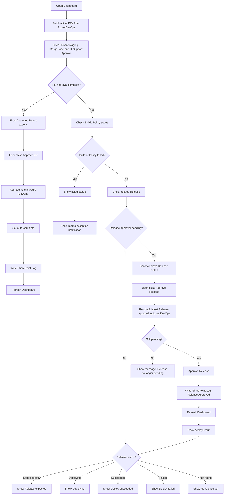
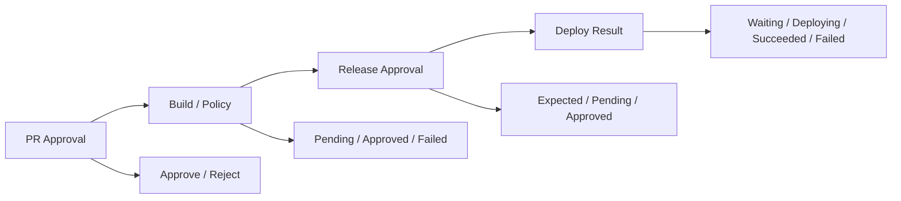

# Approve Release Workflow

เอกสารนี้อธิบาย workflow การ Approve Release บนระบบ ADO Auto-Approve Dashboard

## Main Workflow

## Status Lifecycle

## Dashboard Rules

| Condition | Dashboard Behavior |
| --- | --- |
| PR approval is still pending | Show Approve / Reject actions |
| PR approval complete, build or policy failed | Show failed status and keep visible for attention |
| Release approval is pending | Show Approve Release button |
| Release is expected from CI/CD mapping only | Show Release expected, no approve button |
| Release deploy is running | Show Deploying |
| Release deploy succeeded | Show Deploy succeeded |
| Release deploy failed | Show Deploy failed |
| No release was found | Show No release yet |

## Important Guardrails

- The system must approve release only when Azure DevOps reports a real pending release approval.
- The system must re-check the latest release approval before submitting approval.
- The system must not approve release from CI/CD mapping alone.
- Every successful release approval must be written to SharePoint Log as `Release Approved`.
- Build / Policy exception notification is separate from release approval action.
