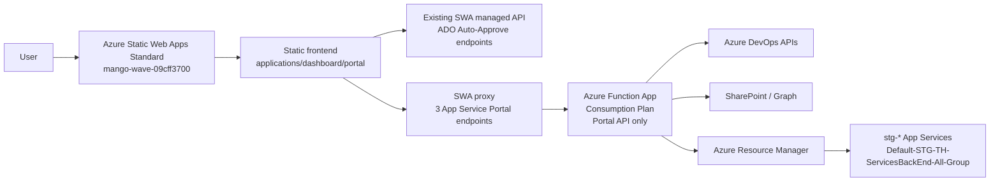

# Function App API Migration Plan

เอกสารนี้เป็นแผนย้ายเฉพาะ App Service Portal backend จาก managed API ภายใน Azure Static Web Apps ไปเป็น Azure Function App แยก เพื่อให้ App Service Portal ใช้ Managed Identity เรียก Azure Resource Manager ได้จริง โดยคง URL เว็บเดิมและรักษา behavior ของ ADO Auto-Approve เดิมให้มากที่สุด

## Decision Update

เลือกแนวทาง `Portal-only Function App + SWA proxy` แทนการย้าย `/api/*` ทั้งชุด:

- ADO Auto-Approve API เดิม เช่น `/api/list-prs`, `/api/approve-pr`, `/api/reject-pr`, `/api/approve-release`, `/api/ado-auth-*` ยังรันบน SWA managed API เหมือนเดิม
- เฉพาะ `/api/appservices`, `/api/appservice-settings`, `/api/restart-appservice` ถูกเปลี่ยนเป็น SWA proxy
- SWA proxy ตรวจ role จาก Static Web Apps auth แล้ว forward ไป Function App ใหม่ผ่าน `APP_SERVICE_FUNCTION_BASE_URL`
- Function App ใหม่ตรวจ `APP_SERVICE_PROXY_SECRET`, ตรวจ role ซ้ำจาก forwarded `x-ms-client-principal`, แล้วใช้ Managed Identity เรียก Azure Resource Manager

## Current Problem

Static Web App `ado-auto-approve` ใช้ SKU `Standard` และเปิด System-Assigned Managed Identity แล้ว แต่ integrated/managed API runtime ส่ง environment มาไม่ครบสำหรับการขอ Managed Identity token:

```text
identityEndpoint=yes
identityHeader=no
msiEndpoint=yes
msiSecret=no
```

เมื่อ backend ขอ token จาก Managed Identity endpoint โดยตรง ได้ผลลัพธ์:

```text
ManagedIdentityTokenError status=403
```

สรุป: RBAC ที่ App Service resource group ไม่ใช่สาเหตุหลักแล้ว เพราะ API runtime ยังขอ ARM token ไม่ได้ตั้งแต่ต้นทาง จึงต้องย้าย API ไป Azure Function App แยกที่มี Managed Identity runtime สมบูรณ์

## Target Architecture



หลักการ:

- Static Web App ยังอยู่ URL เดิม: `https://mango-wave-09cff3700.7.azurestaticapps.net`
- Static Web App ยังเป็น auth/routing gate หลักสำหรับหน้าเว็บและ ADO API เดิม
- Function App เป็น backend host ใหม่เฉพาะ App Service Portal API
- Function App เปิด System-Assigned Managed Identity และรับ RBAC บน App Service staging resource group
- ไม่เปิด Azure Front Door add-on
- ไม่ใช้ personal PAT สำหรับ App Service operation
- ADO Auto-Approve endpoints เดิมยังคง runtime, request/response และ business behavior เดิม

## Cost Target

ค่าใช้จ่ายหลักยังเป็น Static Web Apps Standard:

```text
SWA Standard: ~USD 9/month
Function App Consumption: expected near free for low traffic
Storage Account for Function App: small, usually low baht/month
Managed Identity / RBAC: free
Azure Front Door add-on: not enabled
```

งบคาดการณ์:

```text
~USD 9-11/month
~THB 330-420/month at 37 THB/USD
~USD 108-132/year
~THB 4,000-4,900/year
```

หมายเหตุ: ถ้า rollback SWA กลับ Free จะประหยัด SWA Standard cost ได้ แต่ไม่สอดคล้องกับ requirement production auth/role และ external backend integration รอบนี้ จึงไม่แนะนำ

## Scope

### In Scope

- สร้าง Azure Function App แยกบน Consumption Plan
- Deploy โค้ด `api` เดิมไป Function App
- เปิด System-Assigned Managed Identity ที่ Function App
- Assign RBAC ให้ Function App identity ไปที่:

```text
/subscriptions/f9bca0f4-1e5b-487f-a2ef-a6578a936ef1/resourceGroups/Default-STG-TH-ServicesBackEnd-All-Group
```

- Link Function App เป็น backend API ของ Static Web App
- ปรับ GitHub Actions ให้ deploy frontend ไป SWA และ deploy backend ไป Function App
- ปรับ diagnostics/runbook ให้ตรงกับ architecture ใหม่
- ทดสอบ ADO Auto-Approve เดิมและ App Service Portal

### Out of Scope

- ไม่เปิด Azure Front Door add-on
- ไม่เปลี่ยน domain/URL เว็บหลัก
- ไม่ refactor ADO approve/reject/approve-release business logic
- ไม่เพิ่ม write path สำหรับ App Service app settings
- ไม่ย้าย SharePoint/ADO credential model ในรอบนี้

## Proposed Azure Resources

แนะนำสร้าง resource ใน resource group เดิม `rg-ado-auto-approve` เพื่อคุม cost/budget ง่าย:

```text
Resource group: rg-ado-auto-approve
Region: Southeast Asia หรือ region เดียวกับ resource group ปัจจุบัน
Function App name: func-ado-auto-approve-api
Plan: Consumption
Runtime: Node.js 22 ถ้ารองรับใน Azure Functions ณ ตอนสร้าง; fallback Node.js 20 ถ้าจำเป็น
Storage account: stadoautoapproveapi<unique suffix>
Managed Identity: System-assigned
Application Insights: optional; ถ้าเปิด ให้ตั้ง sampling/retention เพื่อลด cost
```

ถ้า Azure Functions ใน portal ยังไม่รองรับ Node.js 22 สำหรับ Consumption ใน subscription นี้ ให้ใช้ Node.js 20 ก่อน แล้วทดสอบ dependency/runtime ให้ครบ

## Required Function App Settings

ต้อง copy settings จาก SWA API configuration ไป Function App โดยไม่พิมพ์ secret ลงเอกสารหรือ log:

### Shared ADO Auto-Approve Settings

```text
ADO_ORGANIZATION
ADO_PROJECT
ADO_PAT
ADO_TOKEN_STORE_SECRET
ADO_TOKEN_COOKIE_SECRET
AAD_TENANT_ID
AAD_CLIENT_ID
AAD_CLIENT_SECRET
SHAREPOINT_HOSTNAME
SHAREPOINT_SITE_PATH
SHAREPOINT_LIST_NAME
TEAMS_WEBHOOK_URL
LINE_CHANNEL_ACCESS_TOKEN
AZURE_STORAGE_CONNECTION_STRING หรือ storage/table settings ที่ระบบใช้อยู่
```

ให้ยึดรายการจริงจาก Azure Portal Configuration ของ SWA เดิม แต่ห้าม export เป็นไฟล์ plain text ที่ commit เข้า repo

### App Service Portal Settings

```text
AZURE_TENANT_ID=36f04887-ce29-484c-900e-f23ad3f60b77
APP_SERVICE_SUBSCRIPTION_ID=f9bca0f4-1e5b-487f-a2ef-a6578a936ef1
APP_SERVICE_RESOURCE_GROUP=Default-STG-TH-ServicesBackEnd-All-Group
APP_SERVICE_NAME_PREFIX=stg-
APP_SERVICE_PORTAL_ROLE=tester_appservice_manager
APP_SERVICE_CACHE_TTL_SECONDS=60
APP_SERVICE_RESTART_COOLDOWN_SECONDS=300
APP_SERVICE_SHAREPOINT_HOSTNAME=<same or dedicated SharePoint hostname>
APP_SERVICE_SHAREPOINT_SITE_PATH=<same or dedicated SharePoint site path>
APP_SERVICE_SHAREPOINT_LIST_NAME=App Service Portal Log
APP_SERVICE_SHAREPOINT_AUTO_CREATE_COLUMNS=true หรือ false ตาม policy
```

### Function Runtime Settings

Function App จะมี settings runtime เช่น:

```text
AzureWebJobsStorage
FUNCTIONS_EXTENSION_VERSION=~4
FUNCTIONS_WORKER_RUNTIME=node
WEBSITE_NODE_DEFAULT_VERSION=<runtime version>
```

ให้ Azure Portal/CLI สร้างค่า runtime เหล่านี้ ไม่ต้อง commit ค่า secret

## RBAC Plan

หลังสร้าง Function App ให้เอา `principalId` ของ Function App Managed Identity ไป assign role:

Preferred least privilege custom role:

```text
Microsoft.Web/sites/read
Microsoft.Web/sites/config/read
Microsoft.Web/sites/restart/action
```

Fallback role ถ้าต้องเปิดใช้งานเร็ว:

```text
Website Contributor
```

Scope:

```text
/subscriptions/f9bca0f4-1e5b-487f-a2ef-a6578a936ef1/resourceGroups/Default-STG-TH-ServicesBackEnd-All-Group
```

หลังย้ายสำเร็จ ให้พิจารณาลบ RBAC assignment เดิมของ Static Web App identity:

```text
SWA principalId: 69558ef6-ab36-4b6b-a110-9e7a68669465
```

แต่ให้ลบหลัง smoke test ผ่านเท่านั้น

## Security Design

### Request Gate

Static Web Apps ยังคุม `staticwebapp.config.json`:

- `/api/appservices`: `tester_appservice_manager`, `admin`
- `/api/appservice-settings`: `tester_appservice_manager`, `admin`
- `/api/restart-appservice`: `tester_appservice_manager`, `admin`
- ADO endpoints เดิม: `it_support_approve`, `admin`
- anonymous scheduled/webhook endpoints คงตามเดิม

### Backend Role Check

Function App endpoint ทุกตัวต้องยังใช้ `api/shared/auth.js`:

- `requireAnyRole(context, req, [APP_SERVICE_PORTAL_ROLE, 'admin'])`
- `requireRole()` สำหรับ ADO endpoints เดิม

ต้อง verify ว่าเมื่อ SWA link ไป Function App แล้ว header `x-ms-client-principal` ถูกส่งต่อถึง Function App จริง

### App Service Scope Check

คง validation ใน `api/shared/appservice-client.js`:

- normalize app name
- empty name = 400
- name ไม่ขึ้นต้น `stg-` = 403
- list/fetch เฉพาะ resource group ที่ config ไว้
- หาไม่เจอใน allowed scope = 404
- settings read-only เท่านั้น
- restart มี backend cooldown

### Secret Handling

- ห้าม log app setting values
- audit log settings read เฉพาะ key names
- ไม่พิมพ์ app settings/secrets ลง GitHub Actions log
- ไม่ commit exported app settings
- ไม่ใช้ personal PAT สำหรับ Azure App Service operation

## Implementation Phases

### Phase 0: Freeze Current State

1. ยืนยัน production commit ล่าสุดและ working tree clean
2. บันทึก current issue ใน runbook:
   - `ManagedIdentityTokenError status=403`
   - `identityHeader=no`
   - `msiSecret=no`
3. ยืนยัน ADO Auto-Approve ยังใช้งานได้ก่อน migration
4. สร้าง branch หรือ commit plan doc ก่อนเริ่ม infrastructure changes

Validation:

```powershell
git status --short
node --check api\shared\appservice-client.js
node --check api\appservices\index.js
node --check api\appservice-settings\index.js
node --check api\restart-appservice\index.js
```

### Phase 1: Create Function App Infrastructure

ทำโดย Azure Portal หรือ Azure CLI โดยคนที่มีสิทธิ์ subscription:

1. Create Storage Account สำหรับ Function App
2. Create Function App:
   - Consumption Plan
   - Node.js runtime
   - Region เดียวกับ `rg-ado-auto-approve` ถ้าเป็นไปได้
3. Enable System-Assigned Managed Identity
4. Copy app settings จาก SWA API ไป Function App
5. Add App Service Portal settings
6. Assign RBAC ให้ Function App identity ไป staging resource group

CLI outline:

```powershell
az functionapp create `
  --resource-group rg-ado-auto-approve `
  --consumption-plan-location southeastasia `
  --runtime node `
  --runtime-version 20 `
  --functions-version 4 `
  --name func-ado-auto-approve-api `
  --storage-account <storage-account-name>

az functionapp identity assign `
  --resource-group rg-ado-auto-approve `
  --name func-ado-auto-approve-api
```

RBAC outline:

```powershell
az role assignment create `
  --assignee-object-id <function-app-principal-id> `
  --assignee-principal-type ServicePrincipal `
  --role "Website Contributor" `
  --scope "/subscriptions/f9bca0f4-1e5b-487f-a2ef-a6578a936ef1/resourceGroups/Default-STG-TH-ServicesBackEnd-All-Group"
```

### Phase 2: Prepare Repo For Split Deploy

Current workflow deploys both:

```yaml
app_location: "/public"
api_location: "/api"
```

Change target design:

1. SWA workflow deploys frontend only:

```yaml
app_location: "/public"
api_location: ""
output_location: ""
```

2. Add backend Function App deploy workflow:

```yaml
name: Azure Functions API CI/CD
on:
  push:
    branches: [main, master]
    paths:
      - "api/**"
      - ".github/workflows/azure-functions-api.yml"
```

3. Use publish profile or OIDC depending on organization policy
4. Deploy package from `api`
5. Run `npm install` in `api` during build
6. Do not print app settings/secrets

Recommended GitHub secret:

```text
AZURE_FUNCTIONAPP_PUBLISH_PROFILE
```

Alternative with OIDC:

```text
AZURE_CLIENT_ID
AZURE_TENANT_ID
AZURE_SUBSCRIPTION_ID
```

OIDC is cleaner long term but requires Azure federated credential setup

### Phase 3: Link Function App To Static Web App

Link Function App as the SWA backend API.

Portal path:

1. Static Web App `ado-auto-approve`
2. APIs
3. Link existing Function App
4. Select `func-ado-auto-approve-api`
5. Confirm `/api/*` routes resolve to Function App

CLI outline:

```powershell
az staticwebapp functions link `
  --name ado-auto-approve `
  --resource-group rg-ado-auto-approve `
  --function-resource-id "<function-app-resource-id>"
```

หลัง link สำเร็จ ต้องยืนยันว่า SWA auth headers ยังส่งต่อถึง Function App โดยเรียก `/api/userinfo` จาก browser session จริง

### Phase 4: Code Cleanup After External Function Works

หลัง Function App ใช้ Managed Identity ได้จริง:

1. ใน `api/shared/appservice-client.js` ให้พิจารณาลด raw MSI probe path กลับไปใช้ `DefaultAzureCredential` / `ManagedIdentityCredential`
2. เก็บ diagnostics ที่ปลอดภัยไว้ได้ แต่ไม่ควรโชว์รายละเอียด runtime เกินจำเป็นใน production ระยะยาว
3. Update `docs/app-service-portal-runbook.md` ให้ระบุ Function App identity เป็นตัวที่ได้ RBAC
4. Update README architecture diagram/table ให้บอกว่า API host คือ Function App แยก

### Phase 5: Validation

#### Auth And Role

- anonymous เข้า `/portal.html` แล้วถูก redirect login
- user ไม่มี business role เห็น launcher empty/403 ตาม flow
- `it_support_approve` เข้า Dashboard ได้ แต่เข้า Portal ไม่ได้
- `tester_appservice_manager` เข้า Portal ได้ แต่เข้า Dashboard ไม่ได้
- `admin` เข้าได้ทั้งสอง
- `/api/userinfo` จากหน้าเว็บคืน permissions ถูกต้อง

#### ADO Auto-Approve Regression

ทดสอบโดย role `it_support_approve`:

- `/dashboard.html` load ได้
- `/api/list-prs` ยังทำงาน
- Approve PR behavior ไม่เปลี่ยน
- Reject PR behavior ไม่เปลี่ยน
- Approve Release behavior ไม่เปลี่ยน
- ADO logs ยังเข้า SharePoint list เดิม
- Azure DevOps connect/disconnect ยังทำงาน

#### App Service Portal

ทดสอบโดย role `tester_appservice_manager` หรือ `admin`:

- `/api/appservices` คืนเฉพาะ `stg-*`
- `scope.resourceGroup` เป็น `Default-STG-TH-ServicesBackEnd-All-Group`
- unknown app = 404
- non-`stg-` app = 403
- settings read คืน `{ name, value }` เฉพาะ app ที่ allowed
- UI ไม่มี edit/add/delete/save settings
- restart ต้อง confirmation ก่อน POST
- restart สำเร็จแล้ว cooldown ทั้ง frontend/backend
- duplicate restart ใน cooldown ได้ 429

#### Audit

- settings read success/failure log เข้า `App Service Portal Log`
- setting values ไม่เข้า SharePoint, Function logs, browser console, localStorage/sessionStorage
- restart log เข้า `App Service Portal Log`
- ADO logs ยังเข้า ADO Auto-Approve log เดิม

#### Managed Identity

ใน Function App logs ต้องไม่มี:

```text
identityHeader=no
msiSecret=no
ManagedIdentityTokenError status=403
```

Expected path:

- `DefaultAzureCredential` หรือ raw MSI ได้ ARM token
- ARM call สำเร็จหรือถ้า fail ต้องเป็น RBAC/scope error ที่ชัดกว่า credential unavailable

### Phase 6: Rollback Plan

ถ้า Function App migration กระทบ ADO Auto-Approve:

1. Unlink Function App จาก SWA
2. Restore SWA workflow `api_location: "/api"`
3. Redeploy previous known-good commit
4. Keep SWA Standard as-is
5. Re-test ADO Dashboard

ถ้าเฉพาะ App Service Portal ยัง fail แต่ ADO ใช้งานได้:

1. คง Function App link ไว้
2. Disable/feature-flag portal endpoints ชั่วคราวถ้าจำเป็น
3. ไม่ rollback ADO endpoints ถ้าไม่กระทบ

## GitHub Actions Plan

### Frontend SWA Workflow

ปรับ `.github/workflows/azure-static-web-apps.yml`:

```yaml
with:
  azure_static_web_apps_api_token: ${{ secrets.AZURE_STATIC_WEB_APPS_API_TOKEN_MANGO_WAVE_09CFF3700 }}
  repo_token: ${{ secrets.GITHUB_TOKEN }}
  action: "upload"
  app_location: "/public"
  api_location: ""
  output_location: ""
```

### Backend Function Workflow

เพิ่ม `.github/workflows/azure-functions-api.yml`:

```yaml
name: Azure Functions API CI/CD

on:
  push:
    branches:
      - main
      - master
    paths:
      - "api/**"
      - ".github/workflows/azure-functions-api.yml"

jobs:
  build-and-deploy:
    runs-on: ubuntu-latest
    steps:
      - uses: actions/checkout@v4
      - uses: actions/setup-node@v4
        with:
          node-version: 20
          cache: npm
          cache-dependency-path: api/package-lock.json
      - name: Install API dependencies
        working-directory: api
        run: npm ci
      - name: Syntax check
        run: |
          find api -name "*.js" -not -path "*/node_modules/*" -print0 | xargs -0 -n1 node --check
      - name: Deploy Function App
        uses: Azure/functions-action@v1
        with:
          app-name: func-ado-auto-approve-api
          package: api
          publish-profile: ${{ secrets.AZURE_FUNCTIONAPP_PUBLISH_PROFILE }}
```

ให้ปรับ `node-version` เป็น 22 ได้เมื่อ Function App runtime และ GitHub Action support พร้อม

## Files Expected To Change

Phase repo changes:

```text
.github/workflows/azure-static-web-apps.yml
.github/workflows/azure-functions-api.yml
docs/app-service-portal-runbook.md
docs/function-app-api-migration-plan.md
README.md
api/shared/appservice-client.js (cleanup after external Function validation)
```

No expected behavior changes to:

```text
api/approve-pr
api/reject-pr
api/approve-release
public/dashboard.*
```

## Acceptance Criteria

- เว็บยังอยู่ URL เดิม
- Login แล้วเข้า launcher ได้เหมือนเดิม
- Dashboard ใช้งาน ADO Auto-Approve ได้เหมือนเดิม
- App Service Portal list `stg-*` apps ได้จริง
- Settings read-only แสดง full values เฉพาะ authorized role
- Restart App Service สำเร็จผ่าน Managed Identity ของ Function App
- App Service audit แยกจาก ADO log
- ไม่มี app setting values หลุดใน logs/audit
- Function App Consumption cost ต่ำและไม่มี Azure Front Door add-on
- สามารถ rollback กลับ managed API เดิมได้ถ้า migration กระทบ ADO
