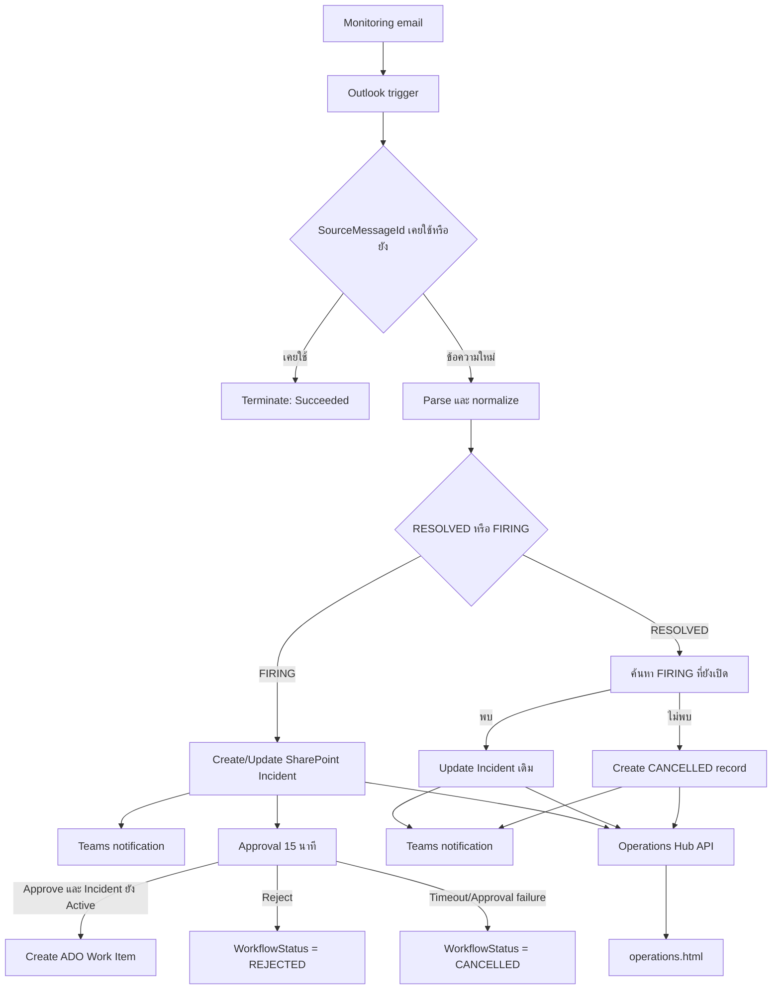
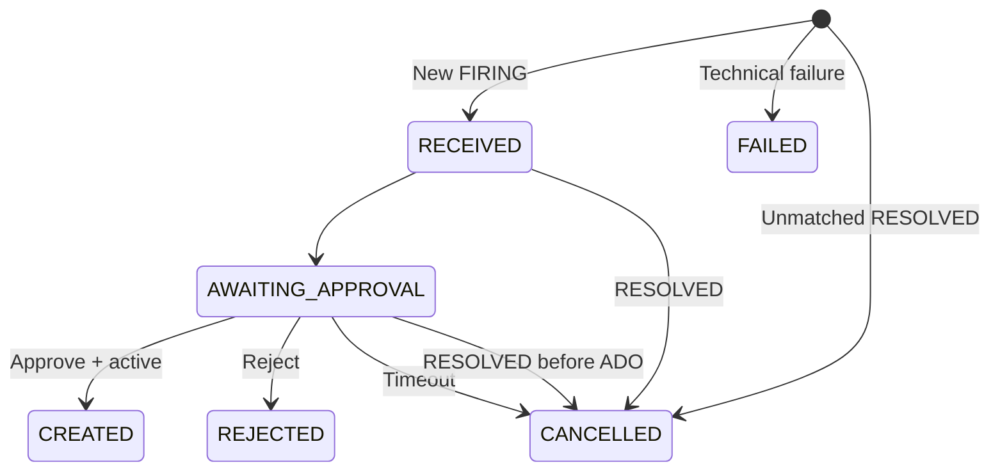

# Operations Hub — Power Automate Flow 1

## สถานะล่าสุด: v2.7

แพ็กเกจ `OperationsHub-IncidentAutomation-v2.7.zip` แก้กรณีอีเมล Outlook ส่ง HTML ที่มีโครงสร้างต่างจากเดิมจนฟิลด์ใน Approval/Teams ว่าง โดยใช้ Action `HTML to text` ของ Content Conversion ก่อนแยก `Alert`, `Resource`, `Metric`, `First Seen` และฟิลด์อื่น ๆ (ไม่ใช้ `htmlToText()` ซึ่งไม่ใช่ Power Automate expression) นอกจากนี้เงื่อนไขรับงานเป็น `Priority = P1` (รองรับทั้ง FIRING และ RESOLVED) โดยไม่บังคับค่า Severity เป็น `CRITICAL`.

แพ็กเกจ v2.7 ต่อจาก v2.4 และรายละเอียด As-built v2.2 ด้านล่างเก็บไว้เป็น baseline และประวัติการออกแบบ โดยให้ข้อกำหนด v2.7 ในส่วนนี้และ `IMPORT-GUIDE-TH.md` มีลำดับสูงกว่าเมื่อมีความแตกต่าง

- Outlook folder: `AzureAppServiceHigh5xxRateCritical`
- FIRING ตรวจจากคำว่า `ALERT FIRING` โดยไม่ผูกกับ prefix `[WaitAlert_AppService]` หรือ `[NowAlert_AppService]`
- RESOLVED ตรวจจากคำว่า `RESOLVED` โดยไม่ผูกกับ prefix `[WaitAlert_AppService]` หรือ `[NowAlert_AppService]`
- ทั้งสองกรณีต้องมี `Severity = CRITICAL` และ `Priority = P1`; รายการอื่นจบแบบ Succeeded โดยไม่เขียนข้อมูล
- ส่ง Approval ให้ `kiattisak.yo@buzzebees.com` เพียงคนเดียว
- `First Seen` และ `Resolved At` ถูกตีความเป็นเวลาไทย แล้วแปลงด้วย `convertToUtc(..., 'SE Asia Standard Time')` ก่อนเขียน SharePoint
- Teams, Approval และ ADO แสดงเวลาไทยจาก `convertTimeZone(..., 'UTC', 'SE Asia Standard Time')`
- Operations Hub ระบุ `Asia/Bangkok` ขณะ format วันที่อย่างชัดเจน
- Deduplicate ทั้ง `SourceMessageId` และ `LastSourceMessageId`
- Approval metadata ไม่เขียนทับสถานะ RESOLVED/CANCELLED และแยก Timeout ออกจาก connector error
- Technical failure record ส่ง `Priority` ซึ่งเป็น Required field ครบถ้วน

มาตรฐานเวลา v2.4 คือ SharePoint เก็บ UTC และทุกหน้าจอแสดง Asia/Bangkok ตัวอย่าง `17/09/2026 22:23` จะเก็บเป็น `2026-09-17T15:23:00Z` และแสดงกลับเป็น `17/09/2026 22:23`

รายละเอียดถัดจากส่วนนี้เก็บคำอธิบาย As-built v2.2 ไว้เป็น baseline และประวัติการออกแบบ โดยให้ข้อกำหนด v2.4 ในส่วนนี้และ `IMPORT-GUIDE-TH.md` มีลำดับสูงกว่าเมื่อมีความแตกต่าง

## Baseline เดิม: As-built v2.2

เอกสารฉบับนี้อธิบาย Power Automate Flow 1 ที่ใช้งานจริงในชื่อ **Operations Hub - Incident Automation v2.2** ตั้งแต่การรับอีเมล Monitoring, การแยก FIRING/RESOLVED, การบันทึก SharePoint, การขออนุมัติ, การสร้าง Azure DevOps Work Item, การแจ้ง Teams และการแสดงผลบน Operations Hub

เอกสารนี้เป็นข้อมูล **As-built** ของแพ็กเกจ `OperationsHub-IncidentAutomation-v2.2.zip` ณ วันที่ 17 กันยายน 2026 ไม่ใช่ข้อกำหนดของ Flow 2–4

## 1. วัตถุประสงค์และขอบเขต

Flow 1 มีหน้าที่ดังนี้

1. รับอีเมล Alert จาก Outlook
2. ป้องกันการประมวลผลอีเมลเดิมซ้ำ
3. แยกประเภทอีเมลเป็น `FIRING` หรือ `RESOLVED`
4. อ่านรายละเอียด Incident จาก HTML email body
5. สร้างหรืออัปเดตรายการใน SharePoint List
6. ส่งข้อความสรุปที่ normalize แล้วเข้า Microsoft Teams
7. สร้าง Approval และรอผลสูงสุด 15 นาที
8. สร้าง Azure DevOps Work Item เฉพาะกรณีที่อนุมัติและ Incident ยังควรเปิดงาน
9. บันทึกข้อมูลที่หน้า `operations.html` ใช้อ่านและแสดงผล
10. บันทึก Technical failure ลง SharePoint เท่าที่ทำได้และแจ้ง Teams

สิ่งที่ Flow 1 **ยังไม่ทำ**:

- ไม่ติดตามการเปลี่ยนสถานะ ADO Work Item หลังจากสร้างแล้ว
- ไม่ปิด ADO Work Item อัตโนมัติเมื่อได้รับ RESOLVED
- ไม่ซิงก์ `AdoState`, `AssignedTo` หรือ `AdoClosedAt` เป็นระยะ
- ไม่ทำ auto-refresh หน้า `operations.html`
- ไม่แทนที่ Flow 2 สำหรับ ADO synchronization/reconciliation

## 2. ภาพรวมสถาปัตยกรรม



ระบบที่เกี่ยวข้อง:

| ระบบ | หน้าที่ |
|---|---|
| Microsoft Outlook | รับอีเมล Monitoring |
| Power Automate | ประมวลผล Workflow ทั้งหมดของ Flow 1 |
| SharePoint Online | เป็น Incident store และแหล่งข้อมูลหลักของ Operations Hub |
| Microsoft Teams | แจ้ง FIRING, RESOLVED, repeated alert และ technical failure |
| Power Automate Approvals | ขออนุมัติก่อนสร้าง ADO Work Item |
| Azure DevOps | เก็บ IT Support Case ที่สร้างหลังอนุมัติ |
| Azure Static Web Apps | ให้บริการหน้า `operations.html` และ Operations API |
| Microsoft Graph | Operations API ใช้อ่านข้อมูล SharePoint |

## 3. Trigger และ Connections

### 3.1 Outlook trigger

Action: `When_a_new_email_arrives_(V3)`

| ค่า | การตั้งค่าปัจจุบัน |
|---|---|
| Mailbox connection | `it-support@buzzebees.com` |
| Folder | `Alert-Monitering` |
| Subject filter | `[WaitAlert_AppService]` |
| Importance | Any |
| Include attachments | false |
| Fetch only with attachment | false |

อีเมล FIRING และ RESOLVED ใช้ Trigger เดียวกัน จากนั้น Flow ตรวจคำว่า `RESOLVED` ใน Subject เพื่อเลือกเส้นทางทำงาน

### 3.2 Connections ที่ Flow ใช้

1. Office 365 Outlook
2. Microsoft Teams
3. SharePoint Online
4. Standard Approvals
5. Azure DevOps

ทุก Connection ต้องอยู่ในสถานะ Connected และบัญชีที่ใช้ต้องมีสิทธิ์กับ Resource ปลายทาง

## 4. ค่าที่ Hard-code ใน Flow

การ Hard-code ต่อไปนี้เป็นค่าที่อนุญาตให้ใช้ตามข้อสรุปของระบบปัจจุบัน

### SharePoint

| ค่า | ปัจจุบัน |
|---|---|
| Site | `https://buzzebees.sharepoint.com/sites/ADOAuto-Approve` |
| List | `Operations Hub Incidents` |
| List ID | `5f744c7f-10a3-4ef4-9cf7-f64f65a71851` |

### Approval

| ค่า | ปัจจุบัน |
|---|---|
| Approvers | `natthakit@buzzebees.com`; `kiattisak.yo@buzzebees.com` |
| Approval type | Basic |
| Timeout | `PT15M` หรือ 15 นาที |
| Notifications | เปิด |
| Reassignment | เปิด |

### Microsoft Teams

| ค่า | ปัจจุบัน |
|---|---|
| Poster | Flow bot |
| Destination | Group chat |
| Chat ID | `19:a0a8b701b02c469b94f493d1ed9903b9@thread.v2` |

Flow ส่งเฉพาะข้อความที่ normalize แล้ว ไม่ส่ง raw email body เข้า Teams

### Azure DevOps

| ค่า | ปัจจุบัน |
|---|---|
| Organization/account | `buzzebees` |
| Project | `Buzzebees` |
| Work item type | `IT Support Case` |
| Area path | `Buzzebees\Other\IT Support Team` |
| Impact Case | `User Request` |
| SystemProgram | `Support Request` |
| TYPE_ALL | `Problem Server` |
| SUBTYPE | `Problem Server` |
| Owner | ชื่อผู้ที่กด Approve (ดึงจาก Approval response) |
| Assigned to | `natthakit@buzzebees.com` |
| Priority Case | `2-High` |
| Permission | `None` |
| Tags | `ITSupport_Pool;Operations_Hub;ITSupport-ProblemServer;ITSupport-AutoCreateIncidentCase` |

## 5. รูปแบบข้อมูลจากอีเมล

Flow อ่านค่าจาก HTML email body โดยค้นหา marker แล้วตัดข้อความถึง `<br>` ถัดไป

| ข้อมูล | Marker ที่ใช้ค้นหา |
|---|---|
| Alert name | `Alert:</b>` |
| Resource | `Resource:` |
| Severity/Priority | `Severity:</b>` |
| Subscription | `Subscription:` |
| Resource group | `Resource Group:` |
| App Service plan | `Plan:` |
| Default host | `Default Host:` |
| Metric | `Metric:` |
| Current value | `Current Value:` |
| Threshold | `Threshold:` |
| Summary | `Summary:</b>` |
| First seen | `First Seen:</b>` |
| Resolved at | `Resolved At:</b>` |

รูปแบบเวลาที่ parser คาดหวังคือ `dd/MM/yyyy HH:mm` และ Flow แปลงเป็น ISO 8601 โดยกำหนด timezone `+07:00`

ตัวอย่าง:

```text
First Seen: 17/09/2026 18:17 น.
Resolved At: 17/09/2026 18:57 น.
```

กฎเวลา:

- `FirstSeenAt` คือเวลาที่ Monitoring ตรวจพบปัญหาครั้งแรก
- `ReceivedAt` คือเวลาที่ Outlook รับอีเมล ไม่ใช่เวลาเริ่ม Incident
- `ResolvedAt` คือเวลาที่ Monitoring ตรวจพบว่าปัญหาสิ้นสุด
- Incident ที่จับคู่กันต้องมี `ResolvedAt > FirstSeenAt`

## 6. การ Normalize ข้อมูล

### Severity และ Priority

Flow แยกค่าด้วย `/`

- ส่วนแรกเป็น `Severity`
- ส่วนสุดท้ายเป็น `Priority`
- หากไม่มี `/` จะใช้ค่า Priority เริ่มต้นเป็น `P2`

### Environment

Flow อนุมาน Environment จากชื่อ Resource

| Prefix | Environment |
|---|---|
| `prd-` | Production |
| `stg-` | Staging |
| `uat-` | UAT |
| `dev-` | Development |
| อื่น ๆ | Unknown |

### IncidentId

Flow สร้าง Incident ID จาก First seen, Resource และ Alert name

```text
INC-{yyyyMMddHHmmss}-{resource}-{alert}
```

จากนั้นแปลงเป็นตัวพิมพ์เล็ก และแทน space กับ `/` ด้วย `-`

ตัวอย่าง:

```text
inc-20260917181700-prd-web-burgerkingcsc-azureappservicehigh5xxratecritical
```

## 7. SharePoint schema

คอลัมน์ Required ของ List มี 6 คอลัมน์ ได้แก่ `IncidentId`, `SourceMessageId`, `AlertStatus`, `WorkflowStatus`, `Priority` และ `ReceivedAt` ดังนั้น SharePoint Update item ทุกจุดใน v2.2 ส่งทั้ง 6 ค่านี้เสมอ

| Column | Type | Required | หน้าที่ |
|---|---|---:|---|
| `Title` | Single line text | ไม่ | ชื่อ Alert |
| `IncidentId` | Single line text | ใช่ | Correlation ID ของ Incident |
| `SourceMessageId` | Single line text | ใช่ | Outlook message ID แรกของ Incident |
| `LastSourceMessageId` | Single line text | ไม่ | Outlook message ID ล่าสุดที่ประมวลผล |
| `AlertStatus` | Choice | ใช่ | `FIRING` หรือ `RESOLVED` |
| `WorkflowStatus` | Choice | ใช่ | สถานะการทำงานของ Flow |
| `Priority` | Choice | ใช่ | Priority จากอีเมลหรือค่าเริ่มต้น |
| `Service` | Single line text | ไม่ | ปัจจุบันใช้ Alert name |
| `Resource` | Single line text | ไม่ | Resource ที่ได้รับผลกระทบ |
| `Environment` | Single line text | ไม่ | Production/Staging/UAT/Development/Unknown |
| `Metric` | Single line text | ไม่ | Metric ของ Alert |
| `Severity` | Single line text | ไม่ | Severity จาก Monitoring |
| `ReceivedAt` | Date and time | ใช่ | เวลาที่รับอีเมล |
| `FirstSeenAt` | Date and time | ไม่ | เวลาเริ่ม Incident |
| `ResolvedAt` | Date and time | ไม่ | เวลาที่ Monitoring รายงานว่าแก้ไขแล้ว |
| `LastAlertAt` | Date and time | ไม่ | เวลาที่ประมวลผล Alert ล่าสุด |
| `OccurrenceCount` | Number | ไม่ | จำนวนอีเมลที่สัมพันธ์กับ Incident |
| `FlowRunId` | Single line text | ไม่ | Power Automate run ID ล่าสุด |
| `ApprovalOutcome` | Single line text | ไม่ | Approve, Reject, Timeout หรือ CancelledByResolved |
| `ApprovalAttempt` | Number | ไม่ | จำนวนครั้งที่ขอ Approval |
| `ApprovalId` | Single line text | ไม่ | Approval ID |
| `ApprovalBy` | Single line text | ไม่ | ผู้ตอบ Approval |
| `ApprovalComment` | Multiple lines text | ไม่ | ความเห็นของผู้ตอบ Approval |
| `ApprovalRequestedAt` | Date and time | ไม่ | เวลาที่ขอ Approval |
| `ApprovalCompletedAt` | Date and time | ไม่ | เวลาที่ Approval สิ้นสุด |
| `Subscription` | Single line text | ไม่ | Azure subscription |
| `ResourceGroup` | Single line text | ไม่ | Azure resource group |
| `AppServicePlan` | Single line text | ไม่ | App Service plan |
| `DefaultHost` | Single line text | ไม่ | Default host name |
| `CurrentValue` | Single line text | ไม่ | Metric value ปัจจุบัน |
| `ThresholdDetail` | Multiple lines text | ไม่ | เงื่อนไข Threshold |
| `AlertSummary` | Multiple lines text | ไม่ | รายละเอียดสรุป Alert |
| `AdoWorkItemId` | Number | ไม่ | ADO Work Item ID |
| `AdoWorkItemUrl` | Hyperlink | ไม่ | ลิงก์ ADO Work Item |
| `AdoState` | Single line text | ไม่ | สถานะ ADO ล่าสุดที่ Flow ทราบ |
| `AssignedTo` | Single line text | ไม่ | ผู้รับผิดชอบ ADO |
| `AdoCreatedAt` | Date and time | ไม่ | เวลาสร้าง ADO Work Item |
| `AdoClosedAt` | Date and time | ไม่ | เวลาปิด ADO Work Item; Flow 1 ยังไม่เขียน |
| `LastSyncedAt` | Date and time | ไม่ | เวลาที่อัปเดตข้อมูลล่าสุด |
| `ErrorDetail` | Multiple lines text | ไม่ | รายละเอียดข้อผิดพลาดสำหรับ Operator |

ค่า Choice ของ `WorkflowStatus`:

- `RECEIVED`
- `AWAITING_APPROVAL`
- `CREATED`
- `REJECTED`
- `FAILED`
- `CANCELLED`

## 8. ลำดับการทำงานระดับ Action

```text
Compose_EmailBody
Scope_Process_Incident
  Compose_SourceMessageId
  Get_items_by_SourceMessageId
  Condition_Message_Already_Processed
    True: Terminate_Duplicate_Message
    False:
      Parse/normalize fields
      Compose_IncidentId
      Condition_Is_RESOLVED
        True: RESOLVED branch
        False: FIRING branch
Scope_Handle_Technical_Failure
  Create_FAILED_incident
  Post_normalized_failure_to_Teams
```

### 8.1 Compose email body

`Compose_EmailBody` เก็บ HTML body เพื่อให้ Compose actions ภายในใช้ parse ข้อมูล ห้ามนำ raw body นี้ไปส่ง Teams โดยตรง

### 8.2 สร้าง SourceMessageId

`Compose_SourceMessageId` ใช้ค่า:

```text
internetMessageId หากมี มิฉะนั้นใช้ Outlook message id
```

### 8.3 Deduplicate ระดับอีเมล

`Get_items_by_SourceMessageId` ค้นหา SharePoint ด้วย `SourceMessageId`

- ถ้าพบ: `Terminate_Duplicate_Message` จบ Run ด้วยสถานะ Succeeded
- ถ้าไม่พบ: ทำ Parse และประมวลผลต่อ

การ Terminate ในจุดนี้เป็น Business control เพื่อหยุด duplicate message ไม่ใช่ข้อผิดพลาด

## 9. FIRING branch

### 9.1 ตรวจ Incident เดิม

`Get_items_by_IncidentId` ค้นหารายการด้วย Incident ID ที่ normalize แล้ว

#### หากพบ Incident เดิม

`Update_repeated_FIRING` ทำงานดังนี้

- คงค่าคอลัมน์ Required ของ Incident เดิม
- อัปเดต `LastAlertAt`
- อัปเดต `LastSourceMessageId`
- เพิ่ม `OccurrenceCount` อีก 1
- อัปเดต `LastSyncedAt` และ `FlowRunId`
- ไม่สร้าง Approval ใหม่
- ไม่สร้าง ADO Work Item ใหม่
- ส่ง Teams ว่าเป็น repeated alert

#### หากไม่พบ Incident เดิม

`Create_FIRING_incident` สร้างรายการใหม่ด้วย:

- `AlertStatus = FIRING`
- `WorkflowStatus = RECEIVED`
- `OccurrenceCount = 1`
- ข้อมูลที่ parse และ normalize จากอีเมล

จากนั้น:

1. ส่ง FIRING notification เข้า Teams
2. อัปเดต `WorkflowStatus = AWAITING_APPROVAL`
3. กำหนด `ApprovalAttempt = 1`
4. บันทึก `ApprovalRequestedAt`
5. เริ่ม Approval และรอสูงสุด 15 นาที

## 10. Approval branch

### 10.1 การสร้าง Approval

Approval แสดงข้อมูลหลักดังนี้

- Incident ID
- Alert name
- Resource
- Environment
- Severity/Priority
- Metric และ Current value
- Threshold
- First seen

### 10.2 การแปลงผล Approval

`Compose_ApprovalResult` แปลงผลเป็น:

| สถานะ action | ผลที่ Flow ใช้ |
|---|---|
| Succeeded + Approve | `Approve` |
| Succeeded + Reject | `Reject` |
| TimedOut | `Timeout` |
| Failed | `Timeout` |

Flow บันทึก Approval ID, ผู้ตอบ, Comment, Outcome และเวลาสิ้นสุดลง SharePoint

### 10.3 Approve

ก่อนสร้าง ADO Work Item Flow ใช้ `Recheck_incident_before_ADO` ตรวจอีกครั้ง โดยต้องผ่านทุกข้อ:

1. `AlertStatus` ไม่ใช่ `RESOLVED`
2. `WorkflowStatus` ไม่ใช่ `CANCELLED`
3. `AdoWorkItemId` ยังว่าง

ถ้าผ่านจึงสร้าง ADO Work Item และอัปเดต SharePoint:

- `WorkflowStatus = CREATED`
- `AdoWorkItemId`
- `AdoWorkItemUrl`
- `AdoState` ซึ่งปกติเริ่มที่ `New`
- `AssignedTo`
- `AdoCreatedAt`
- `LastSyncedAt`

ถ้าไม่ผ่าน จะไม่สร้าง ADO และตั้ง:

- `WorkflowStatus = CANCELLED`
- `ApprovalOutcome = CancelledByResolved`

### 10.4 Reject

- ไม่สร้าง ADO Work Item
- ตั้ง `WorkflowStatus = REJECTED`

### 10.5 Timeout หรือ Approval action ล้มเหลว

- ไม่สร้าง ADO Work Item
- ตั้ง `WorkflowStatus = CANCELLED`
- ตั้ง `ApprovalOutcome = Timeout`
- บันทึก `ErrorDetail` ว่า Approval หมดอายุหลัง 15 นาที

## 11. RESOLVED branch

Flow อ่าน `Resolved At` และค้นหา Incident ที่ตรงตามทุกข้อ:

1. `Title` ตรงกับ Alert name
2. `Resource` ตรงกัน
3. `AlertStatus = FIRING`
4. `ResolvedAt` ของรายการเดิมยังว่าง
5. `FirstSeenAt < ResolvedAt` ของอีเมล RESOLVED

หากพบมากกว่าหนึ่งรายการ Flow เรียง `FirstSeenAt` จากใหม่ไปเก่าและเลือกรายการแรก

### 11.1 พบ FIRING ที่ตรงกัน

Flow อัปเดต Incident เดิม:

- `AlertStatus = RESOLVED`
- `ResolvedAt` ตามอีเมล
- `LastAlertAt`
- `LastSourceMessageId`
- เพิ่ม `OccurrenceCount`
- อัปเดต `LastSyncedAt` และ `FlowRunId`

การกำหนด Workflow status:

| Workflow status ก่อน RESOLVED | หลัง RESOLVED |
|---|---|
| `RECEIVED` | `CANCELLED` |
| `AWAITING_APPROVAL` | `CANCELLED` |
| ค่าอื่น | คงค่าเดิม |

ตัวอย่าง: Incident ที่สร้าง ADO แล้วจะมี `AlertStatus = RESOLVED` แต่ยังคง `WorkflowStatus = CREATED` จนกว่า Flow 2 จะซิงก์หรือปิด ADO

### 11.2 ไม่พบ FIRING ที่ตรงกัน

Flow สร้าง SharePoint item ใหม่:

- `AlertStatus = RESOLVED`
- `WorkflowStatus = CANCELLED`
- บันทึก `ResolvedAt`
- บันทึก `ErrorDetail` ว่าไม่พบ FIRING ที่จับคู่ได้
- ไม่สร้าง Approval
- ไม่สร้าง ADO Work Item
- ไม่ถือเป็น Technical failure

กรณี `ResolvedAt <= FirstSeenAt` จะไม่ผ่านเงื่อนไขจับคู่ และจะเข้าสู่กรณี unmatched RESOLVED/CANCELLED

## 12. Technical failure handling

`Scope_Handle_Technical_Failure` ทำงานเมื่อ `Scope_Process_Incident` มีสถานะ Failed หรือ TimedOut

Flow จะพยายาม:

1. สร้าง SharePoint item ที่มี `WorkflowStatus = FAILED`
2. ใช้ Incident ID รูปแบบ `FAILED-{GUID}`
3. บันทึก Flow Run ID ใน `ErrorDetail`
4. ส่งข้อความแจ้ง Technical failure เข้า Teams

Teams notification ถูกตั้งให้ทำงานต่อไม่ว่า `Create_FAILED_incident` จะ Succeeded, Failed หรือ TimedOut เพื่อเพิ่มโอกาสที่ Operator จะได้รับแจ้ง

## 13. State model



`AlertStatus` และ `WorkflowStatus` เป็นคนละมิติ:

- `AlertStatus` บอกสถานะจาก Monitoring: FIRING/RESOLVED
- `WorkflowStatus` บอกสถานะของกระบวนการ Automation

## 14. การแสดงผลบน operations.html

หน้าเว็บไม่ได้อ่าน Power Automate โดยตรง แต่ใช้เส้นทาง:

```text
operations.html
  -> GET /api/operations/dashboard
  -> GET /api/operations/incidents
  -> Microsoft Graph
  -> SharePoint List: Operations Hub Incidents
```

Operations API ไม่มี cache ของ Incident data และส่ง HTTP header `no-store, no-cache, must-revalidate`

พฤติกรรมปัจจุบัน:

- Dashboard โหลดข้อมูลเมื่อเปิดหน้าและเมื่อกด `Refresh`
- Dashboard แสดง 10 Incident ล่าสุด
- หน้า Incidents อ่านรายการสูงสุด 1,000 รายการ
- หน้า Incidents โหลดเมื่อเปิดหน้า เปลี่ยน filter หรือกด Search
- หน้าเว็บยังไม่มี polling หรือ push update อัตโนมัติ

ดังนั้นเมื่อ Power Automate สร้างรายการใน SharePoint แล้ว ผู้ใช้ต้องกด Refresh, Reload หรือเข้าเมนู Incidents ใหม่เพื่อดูข้อมูลล่าสุด

การแปลงเป็น Tracking status บนเว็บ:

| เงื่อนไข SharePoint | Tracking status บนเว็บ |
|---|---|
| Workflow `FAILED`/`ACTION_REQUIRED` | `FAILED` |
| Workflow `CANCELLED` | `CANCELLED` |
| Workflow `RECEIVED`/`AWAITING_APPROVAL` | `PENDING` |
| มี ADO ID และ ADO state ปิดแล้ว | `CLOSED` |
| มี ADO ID และยังไม่ปิด | `OPEN` |
| Alert `RESOLVED` และไม่มี ADO | `CLOSED` |
| อื่น ๆ | `NOT_CREATED` |

## 15. Test matrix ที่แนะนำ

### Test 1 — New FIRING + Approve

ผลที่คาดหวัง:

- สร้าง SharePoint item หนึ่งรายการ
- ก่อนอนุมัติเป็น `FIRING/AWAITING_APPROVAL`
- มี Teams notification และ Approval
- หลัง Approve สร้าง ADO เพียงหนึ่งรายการ
- SharePoint เป็น `FIRING/CREATED` และมี ADO ID/URL
- หน้าเว็บแสดง Tracking status `OPEN`

### Test 2 — New FIRING + Reject

- ไม่สร้าง ADO
- SharePoint เป็น `FIRING/REJECTED`
- เก็บ Approval metadata ครบ

### Test 3 — Approval timeout

- รอครบ 15 นาทีโดยไม่ตอบ
- ไม่สร้าง ADO
- SharePoint เป็น `FIRING/CANCELLED`
- `ApprovalOutcome = Timeout`

### Test 4 — Repeated FIRING

- ส่ง FIRING ที่มี Incident ID เดียวกันแต่ message ID ใหม่
- ไม่สร้าง SharePoint item ใหม่
- ไม่สร้าง Approval ใหม่
- เพิ่ม `OccurrenceCount`
- อัปเดต `LastSourceMessageId`

### Test 5 — Duplicate message

- ให้ message ID เดิมถูกประมวลผลซ้ำ
- Run จบแบบ Succeeded ที่ `Terminate_Duplicate_Message`
- ไม่สร้าง ADO/Approval/SharePoint item เพิ่ม

### Test 6 — Matching RESOLVED

- ใช้ Alert และ Resource เดียวกัน
- กำหนด `ResolvedAt > FirstSeenAt`
- อัปเดต Incident เดิม ไม่สร้างรายการใหม่
- `AlertStatus = RESOLVED`

### Test 7 — Unmatched RESOLVED

- ส่ง RESOLVED ที่ไม่มี FIRING ตรงกัน
- สร้างรายการ `RESOLVED/CANCELLED`
- ไม่สร้าง Approval หรือ ADO
- Run ไม่ควรถูกนับเป็น Technical failure

### Test 8 — Malformed email

- เปลี่ยน marker หรือรูปแบบเวลาจากที่ parser รองรับ
- ตรวจ Run history, SharePoint FAILED record และ Teams failure notification

## 16. ข้อจำกัดและความเสี่ยงของ v2.2

### 16.1 หน้าเว็บไม่ Real-time

รายการใหม่ไม่ push เข้าหน้าเว็บที่เปิดค้างไว้ ต้อง Refresh เพื่ออ่าน SharePoint อีกครั้ง

### 16.2 Parser ผูกกับ HTML template

Parser ใช้ marker และ `<br>` แบบตรงตัว หาก Monitoring เปลี่ยน HTML, ชื่อ field, ลำดับ tag หรือรูปแบบวันที่ อาจ parse ได้ค่าว่างหรือเวลาไม่ถูกต้อง

### 16.3 Dedup ของ repeated FIRING

การตรวจ duplicate เริ่มต้นค้นเฉพาะ `SourceMessageId` แต่ repeated FIRING จะเก็บ message ล่าสุดไว้ใน `LastSourceMessageId` โดยไม่แทนค่า `SourceMessageId` เดิม หาก Outlook ส่ง message เดิมของ repeated FIRING ให้ Flow ประมวลผลซ้ำอีกครั้ง อาจเพิ่ม `OccurrenceCount` ซ้ำได้

ข้อเสนอสำหรับรุ่นถัดไป: ค้นหาทั้ง `SourceMessageId` และ `LastSourceMessageId` หรือสร้าง List แยกสำหรับ processed message IDs

### 16.4 Race condition ระหว่าง Approval กับ RESOLVED

SharePoint บังคับให้ Update item ส่งคอลัมน์ Required ครบ 6 ค่า การอัปเดต Approval metadata ใน v2.2 ส่ง `AlertStatus = FIRING` และ `WorkflowStatus = AWAITING_APPROVAL` จากข้อมูลของ Run FIRING

ถ้า RESOLVED อีก Run หนึ่งอัปเดตรายการเป็น `RESOLVED/CANCELLED` ขณะที่ Approval กำลังรออยู่ การอัปเดต metadata หลัง Approval อาจเขียนสถานะกลับเป็น FIRING/AWAITING_APPROVAL ก่อนขั้นตอน recheck และอาจทำให้ ADO ถูกสร้างทั้งที่ Alert RESOLVED แล้ว

ข้อเสนอสำหรับรุ่นถัดไป:

1. Get item ล่าสุดก่อนเขียน Approval metadata
2. เก็บ AlertStatus/WorkflowStatus ปัจจุบันจาก SharePoint
3. Update เฉพาะ metadata โดยส่ง Required fields ด้วยค่าปัจจุบัน
4. Recheck อีกครั้งก่อน Create ADO
5. ใช้ concurrency control หรือ ETag หาก Connector รองรับ

### 16.5 Failure record อาจเขียน SharePoint ไม่สำเร็จ

`Create_FAILED_incident` ใน v2.2 ไม่ได้กำหนด `Priority` แต่ List ปัจจุบันตั้ง `Priority` เป็น Required จึงมีความเสี่ยงที่ error handler จะสร้าง FAILED record ไม่สำเร็จ ถึงแม้ Teams failure notification ยังถูกตั้งให้พยายามส่งต่อ

ข้อเสนอสำหรับรุ่นถัดไป: ใส่ `Priority = P2` หรือ Priority fallback ที่เป็น Choice ที่ถูกต้องใน FAILED record

### 16.6 Approval connector failure ถูกจัดเป็น Timeout

`Start_and_wait_for_an_approval` ที่ Failed จะถูกแปลงเป็น `Timeout` ไม่ใช่ `FAILED` ทำให้แยกไม่ได้ว่าเป็นผู้ใช้ไม่ตอบหรือ Connector ล้มเหลว

ข้อเสนอสำหรับรุ่นถัดไป: แยก `TimedOut` และ `Failed` เป็นคนละเส้นทาง

### 16.7 RESOLVED correlation ไม่ใช้ FirstSeen เท่ากันแบบ exact

Flow ปัจจุบันไม่ได้บังคับว่า FirstSeen ในอีเมล RESOLVED ต้องเท่ากับ FIRING แต่เลือก FIRING ล่าสุดที่มี Alert/Resource เดียวกันและ `FirstSeenAt < ResolvedAt` วิธีนี้รองรับอีเมล RESOLVED ที่ไม่มี FirstSeen ที่เชื่อถือได้ แต่หากมี Incident ซ้อนกันของ Alert/Resource เดียวกันอาจจับคู่ผิดรายการได้

### 16.8 Flow 1 ยังไม่ปิด ADO

เมื่อ RESOLVED มาหลังสร้าง ADO แล้ว Flow 1 จะบันทึก AlertStatus เป็น RESOLVED แต่คง WorkflowStatus เป็น CREATED และไม่เปลี่ยน ADO state ต้องใช้ Flow 2 สำหรับ synchronization และ closure policy

## 17. Runbook การตรวจสอบปัญหา

### อีเมลเข้าแต่ Flow ไม่รัน

ตรวจ:

1. Flow อยู่สถานะ On
2. อีเมลอยู่ใน folder `Alert-Monitering`
3. Subject มี `[WaitAlert_AppService]`
4. Outlook connection ยัง Connected
5. Trigger history มีรายการหรือไม่

### Flow รันแต่ SharePoint ไม่มีข้อมูล

ตรวจ:

1. SharePoint connection
2. Site/List ที่ action ชี้ไป
3. คอลัมน์ Required ทั้ง 6 ค่า
4. Choice value ถูกส่งผ่าน path `/Value`
5. Run history ของ Create/Update item

### SharePoint มีข้อมูลแต่หน้าเว็บไม่แสดง

ตรวจ:

1. กด Refresh หรือ Reload หน้า `operations.html`
2. บัญชีมี role `it_support_approve` หรือ `admin`
3. `/api/operations/dashboard` ไม่ตอบ 401/403/503
4. Static Web App settings ชี้ `buzzebees.sharepoint.com` และ `/sites/ADOAuto-Approve`
5. Entra application มี Graph permission อ่าน SharePoint site

### Approve แล้วไม่สร้าง ADO

ตรวจ:

1. `ApprovalOutcome`
2. `AlertStatus` และ `WorkflowStatus` ก่อน Create ADO
3. มี `AdoWorkItemId` อยู่แล้วหรือไม่
4. Azure DevOps connection
5. Area path, Work item type และ custom fields ยังมีอยู่ใน ADO process

## 18. Import, rollback และไฟล์ที่เกี่ยวข้อง

แพ็กเกจที่ใช้งาน:

```text
artifacts/power-automate/OperationsHub-IncidentAutomation-v2.2.zip
```

ไฟล์สร้างและตรวจแพ็กเกจ:

```text
scripts/build-operations-hub-flow-package.js
scripts/validate-operations-hub-flow-package.js
artifacts/power-automate/IMPORT-GUIDE-TH.md
```

หลักการ rollout:

1. Import แบบ `Create as new`
2. ตรวจ Connections ทั้ง 5 รายการ
3. เปิด Flow editor และตรวจ Flow checker
4. Save และทดสอบตาม Test matrix
5. เปิด v2.2 เมื่อพร้อม
6. ปิด Flow เดิมหลังทดสอบ v2.2 ผ่านเท่านั้น

หากต้อง rollback ให้ Turn off v2.2 และ Turn on Flow เดิม โดยต้องระวังไม่ให้ Flow สองตัวรับอีเมลชุดเดียวกันพร้อมกัน

## 19. ขอบเขตที่แนะนำสำหรับ Flow 2

Flow 2 ควรรับผิดชอบ:

1. ตรวจ ADO Work Item ที่มี `AdoWorkItemId`
2. อัปเดต `AdoState` และ `AssignedTo`
3. บันทึก `AdoClosedAt` เมื่อ Work Item ปิด
4. กำหนด policy ว่า RESOLVED จะปิด ADO อัตโนมัติหรือรอเจ้าหน้าที่
5. ทำ reconciliation เป็นระยะเมื่อ event หรือ webhook ขาดหาย
6. ป้องกันการแก้สถานะ SharePoint ย้อนกลับด้วย optimistic concurrency
7. อัปเดต `LastSyncedAt` และบันทึก ErrorDetail ที่ปลอดภัยสำหรับ Operator

ก่อนเริ่ม Flow 2 ควรแก้ข้อจำกัดในหัวข้อ 16.3–16.6 ของ Flow 1 ก่อน เพื่อให้ lifecycle ระหว่าง Approval, RESOLVED และ ADO มีความปลอดภัยเมื่อเกิดหลาย Run พร้อมกัน

## 20. ภาคผนวก — Action inventory ของ v2.2

แพ็กเกจประกอบด้วย 55 actions ตามโครงสร้างต่อไปนี้

```text
Compose_EmailBody
Scope_Process_Incident
  Compose_SourceMessageId
  Get_items_by_SourceMessageId
  Condition_Message_Already_Processed
    TRUE
      Terminate_Duplicate_Message
    FALSE
      Compose_IsResolved
      Compose_AlertName
      Compose_Resource
      Compose_SeverityPriority
      Compose_Severity
      Compose_Priority
      Compose_Subscription
      Compose_ResourceGroup
      Compose_AppServicePlan
      Compose_DefaultHost
      Compose_Metric
      Compose_CurrentValue
      Compose_ThresholdDetail
      Compose_AlertSummary
      Compose_FirstSeenRaw
      Compose_FirstSeenAt
      Compose_Environment
      Compose_IncidentId
      Condition_Is_RESOLVED
        TRUE — RESOLVED
          Compose_ResolvedAtRaw
          Compose_ResolvedAt
          Get_latest_open_FIRING
          Condition_Matching_FIRING_Found
            TRUE
              Update_matching_incident_RESOLVED
              Post_RESOLVED_to_Teams
            FALSE
              Create_unmatched_RESOLVED_as_CANCELLED
              Post_unmatched_RESOLVED_to_Teams
        FALSE — FIRING
          Get_items_by_IncidentId
          Condition_FIRING_Incident_Exists
            TRUE
              Update_repeated_FIRING
              Post_repeated_FIRING_to_Teams
            FALSE
              Create_FIRING_incident
              Post_FIRING_to_Teams
              Update_incident_AWAITING_APPROVAL
              Start_and_wait_for_an_approval
              Compose_ApprovalResult
              Update_approval_metadata
              Condition_Approved
                TRUE
                  Recheck_incident_before_ADO
                  Condition_Incident_still_active
                    TRUE
                      Create_Azure_DevOps_work_item
                      Update_incident_CREATED
                    FALSE
                      Update_approval_cancelled_by_RESOLVED
                FALSE
                  Condition_Rejected
                    TRUE
                      Update_incident_REJECTED
                    FALSE
                      Update_incident_APPROVAL_TIMEOUT
Scope_Handle_Technical_Failure
  Create_FAILED_incident
  Post_normalized_failure_to_Teams
```

ข้อมูลตรวจสอบแพ็กเกจ:

| รายการ | ค่า |
|---|---|
| Display name | `Operations Hub - Incident Automation v2.2` |
| Content version | `2.2.0.0` |
| Actions | 55 |
| SharePoint actions | 15 |
| SharePoint Update actions | 8 |
| Teams actions | 5 |
| Approval timeout | `PT15M` |
| Import mode | Create as new |
| SHA-256 | `7631E1CC1A8BC0CF12CDCFCFC4129AE4987B128860EC80867AB114CAE00B4043` |
